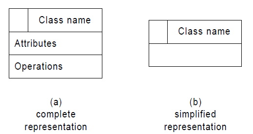
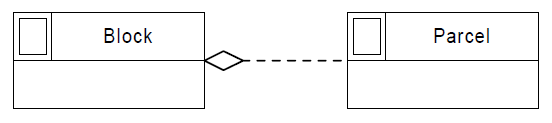
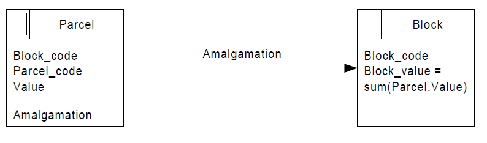
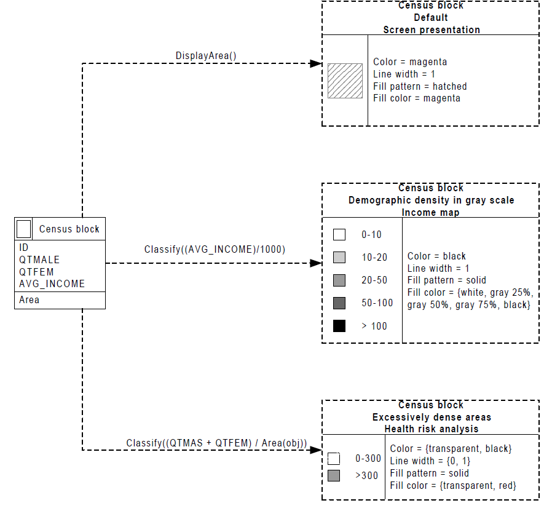

.. _conceptual_model_spatial_data:

=================================
Conceptual Model for Spatial Data
=================================

Semantic and object-oriented data models, such as Entity-Relatonship Model (E-R_), Object-modeling technique (OMT_), and others, have been extensively used for modeling geographic applications.

Despite their semantic expressiveness, such models present limitations to adequately model those applications, since they do not provide appropriate primitives for representing spatial data.

Borges_ (2001) proposes the **OMT-G model**, an object oriented data model for geographic applications.

**OMT-G** provides primitives for modeling the geometry and the topology of spatial data, supporting different topological structures, multiple views of objects, and spatial relationships.

**OMT-G** also includes tools to specify transformation processes and presentation alternatives, that allow, among many other possibilities, modeling for multiple representations and multiple presentations.

The OMT-G Data Model
====================

The **OMT-G** model is based on three main concepts:

- Classes
- Relationships
- Spatial Integrity Constraints

DIAGRAMS
========

**OMT-G** proposes the use of three different diagrams in the process of designing a geographic application.

The first, and more usual one, is the **Class Diagram**, in which all classes are specified, along with their representations and relationships. From this diagram, it is possible to derive a set of spatial integrity constraints that must be observed in the implementation.

When the class diagram indicates the need for multiple representations of any class, or when the application involves the derivation of some class from others, a **Transformation Diagram** must be built. In it, all transformation processes can be specified, allowing for the identification of any required methods for the implementation.

Finally, a **Presentation Diagram** must be built in order to provide guidelines for the visual aspect of objects in the implementation. There can be several visual aspects for any given class, which allows for the definition of a view or set of views for
each application or group of users.

Class Diagram
=============

In OMT-G, the class diagram is used to describe the structure and contents of a geographic database. It contains specific elements of the structure of the database, in special object classes and their relationships, and no transformations or other dynamic processes are considered.

**Class Structure**

The classes defined by the OMT-G model represent the three main groups of data (continuous, discrete, and non-spatial) that can be found in geographic applications, thereby allowing for an integrated view of the modeled space. The classes can be georeferenced or conventional.

A **Conventional Class** describes a set of objects with similar properties, behavior, relationships, and semantics, and which can have some sort of relationship with spatial objects, but which do not have geometric or geographic properties.

A **Georeferenced Class** describes a set of objects that have spatial representation and are associated to features on Earth, assuming the fields and objects view.

Georeferenced Classes
---------------------

Georeferenced Classes are specialized into **Geo-Field** and **Geo-Object** classes.

Geo-Field
~~~~~~~~~

**Geo-Field** Classes represent objects and phenomena that are continuously distributed over the space, corresponding to variables such as soil type, relief, and mineral contents.

.. image:: ./omtg/geofield.png
  :class: inline

Geo-Object
~~~~~~~~~~

**Geo-Object** classes represent individual, particular geographic objects, which can be traced back to real world elements, such as buildings, rivers, and trees.

A **Geo-Object with Geometry Class** represents objects which have only geometric properties (points, lines, and polygons), and is specialized precisely in classes named Point, Line, and Polygon, such as bus stop, curb line, and municipal limits, for example.

.. image:: ./omtg/geoobjectclass.png
  :class: inline

A **Geo-Object with Geometry and Topology** represents objects which have, in addition to geometric properties, topological connectivity properties, and are specifically suited to the representation of spatial network structures, such as water supply systems, electrical distribution systems, or road networks.

.. image:: ./omtg/geoobjecttopology.png
  :class: inline

Relationships
-------------

**OMT-G** represents the three types of relationship that can occur between its classes:

- Simple Associations
- Topological Network Relations
- Spatial Relations.

**Simple Associations** represent structural relationships between objects of different classes, conventional as well as georeferenced. 

**Spatial Relations** represent the topologic, metric, ordinal, and fuzzy relationships. Some relations can be derived automatically, from the geometry of each object, during the execution of data entry or spatial analysis operations.

**Topologic Relations** are an example of this. Others need to be specified by the user, in order to allow the system to store and maintain that information. The latter are called explicit relations.

.. image:: ./omtg/relationship.png
  :class: inline

In the **DE-9IM** model, a minimum set of spatial relation operators is identified, comprising only five spatial relations, from which all others can be specified: **touch**, **in**, **cross**, **overlap**, and **disjoint**.

However, sometimes a larger set is required due to cultural or semantic concepts that are familiar to the users. These include relations such as **adjacent to**, **coincide**, **contain**, and **near**, which are in fact special cases of one of the five basic relations, but deserve special treatment because of their common use in practice.

Additional constraints can be formulated in case some additional relation is required by the application. These include any kind of directional or relative spatial relations, such as **north of**, **left of**, **in front of**, or **above**.

Cardinality
-----------

Relationships are characterized by their cardinality_. The notation for cardinality_ adopted by OMT-G is the same used by UML_.

  
Generalization and Specialization
---------------------------------

**Generalization** is the process of defining classes that are more general (superclasses) than classes with similar characteristics (subclasses).

**Specialization** is the inverse process, in which more specific classes are detailed from generic ones, adding new properties in the
form of attributes. Each subclass inherits attributes, operations, and associations from the superclass.

In the **OMT-G** model, the **generalization and specialization** abstractions apply both to georeferenced classes and conventional classes, following the definitions and notation proposed for UML, where a triangle connects a superclass to its subclasses.

Each **generalization** can have an associated discriminator, indicating which property is being abstracted by the generalization relationship.

.. image:: ./omtg/generalization.png
  :class: inline

**Generalizations**(spatial or not) can be specified as **total** or **partial**.

A **Generalization** is **Total** when the union of all instances of the subclasses is equivalent to the complete set of instances of the superclass. In OMT-G, the totallity is presented by a dot placed in the upper vertex of the triangle that denotes the generalization.

**OMT-G** also adopts the UML_ predefined constraint elements **Disjoint** and **Overlapping**, that is, in a **Disjoint** relation the triangle is left blank and in a **Overlapping** relation the triangle is filled.

.. image:: ./omtg/generalization_complete.png
  :class: inline
  
Aggregation
-----------

**Aggregation** is a special form of association between objects, where one of them is considered to be assembled from others.

The graphic notation used in OMT-G follows the one used by UML.

An **Aggregation** can occur between **Conventional Classes**:

.. image:: ./omtg/umlaggregation.png
  :class: inline

...between **Georeferenced and Conventional Classes**:

.. image:: ./omtg/aggregation_con_geo.png
  :class: inline

...and when the **Aggregation** is between **Georeferenced Classes**, **Spatial Aggregation** must be used.

**Spatial Aggregation** is a special case of aggregation in which topological “whole-part” relationships are made explicit.

The usage of this kind of aggregation imposes spatial integrity constraints regarding the existence of the aggregated object and the corresponding sub-objects.

In spatial aggregation, also called topological “whole-part”, the geometry of each part is entirely contained within the geometry of the whole. Also, no overlapping among the parts is allowed and the geometry of the whole is fully covered by the geometry of the parts.

Cartographic Generalization
---------------------------

**Generalization**, in the cartographic sense, can be seen as a series of transformations that are performed over the representation of spatial information, geared towards improving readability and understanding of data.

For instance, a real world object can have several different spatial representations, according to the current viewing scale.

A city can be represented in a smallscale map as a point, and as a polygon in a large-scale map. In this sense, this paper uses the term representation in the sense of a coding of the geometry of geographic objects (involving aspects such as resolution, spatial dimension, precision, level of detail, and geometric/topologic behavior).

**Cartographic Generalization** can occur in two representation variations: according to **Geometric Shape** and according to **Scale**.

The variation according to **Geometric Shape** is used to record the simultaneous existence of multiple scale-independent representations for a class. For instance, a river can be represented by its axis, as a single line, as the space between its margins, as a polygon covered by water, or as a set of flows (directed arcs) within river sections, forming a hydrographic network.

Variation according to **Scale** is used in the representation of different geometric aspects of a given class, each corresponding to a range of scales. A city can be represented by its political borders (a polygon) in a larger scale, and by a symbol (a point) in a smaller scale.

.. image:: ./omtg/generalization_geo_scale.png
  :class: inline

The notation used for cartographic generalization uses a square to connect the superclass to its subclasses. The subclass is connected to the square by a dashed line. As a discriminator, the word Scale is used to mean variation according to scale, and the word Shape is used to determine variation according to geometric shape. The square is blank when subclasses are disjoint and filled if subclass overlapping is allowed.

The variation according to geometric shape can also be used in the representation of classes which simultaneously have georeferenced and conventional instances. For instance, a traffic sign can exist in the database as a non-georeferenced object, such as a warehouse item, but it becomes georeferenced when installed at a particular location.

Transformation Diagrams
=======================

The **Transformation Diagram** proposed for **OMT-G** follows the UML_ notation for the state and activity diagrams and is used to specify transformations between classes. Even though it is used to specify transformation operations, the transformation diagram still operates at the conceptual representation level. This is because both the source and the results of the transformation are representations.

  
A **Transformation Operator** adequate for the transformation diagram can basically be any algorithm that manipulates and modifies existing data on the representation of an object. This is often necessary in the execution of complex spatial analysis procedures, in which a given class or set of classes need to be transformed so that they can be more easily compared.

Geometric Operators
-------------------

- Centroid determination: select a point that is internal to a given polygon, usually its center of gravity.
- Convex hull: define the boundaries of the smallest convex polygon that contains a given point set.
- Delaunay triangulation: given a point set, define of a set of non-overlapping triangles in which the vertices are the points of the set.
- Isoline generation: build a set of lines and polygons that describe the intersection between a given 3-D surface and a horizontal plane.
- Polygon triangulation: divide a polygon into non-overlapping neighboring triangles.
- Skeletonization: build a 1-D version of a polygonal object, through an approximation of its medial axis.
- Voronoi diagram: given a set of sites (points), divide the plane in polygons so that each polygon is the locus of the points closer to one of the sites than to any other site.

  
Map Generalization Operators
----------------------------

- Aggregation: join point elements which are very close to each other, representing the result with the limits of the area occupied by the point set.
- Amalgamation: join nearly contiguous and similar areas, by eliminating borders between them.
- Collapse: reduce the dimension of the representation of an object, caused by its representation’s size reduction. An area element (2-D) that becomes too small due, for instance, to scale reduction, would be represented as a line (1-D) or point (0-D).
- Merging: join two or more parallel lines that are too close to each other into a single line.
- Refinement: discard less significant elements, which are close to more important ones, in order to preserve the visual characteristics of the overall representation but with less information density. In the opposite sense, this operator is often named Selection.
- Simplification: reduce the number of vertices employed to represent the element, in order to produce an appearance that is similar to the original, though simpler.
- Smoothing: displace the vertices used in the representation, in order to eliminate small disturbances and to capture the main tendencies as to the graphical shape.

Spatial Analysis Operators
--------------------------

- Buffer construction: create a polygon that contains all points of the plane closer than a given distance to an object.
- Classification: separate objects in groups, according to a set of criteria
- Grid analysis: manipulate information contained in tesselations (mostly in the form of digital images), including vectorization (extract points, lines and polygons from an image), rasterization (transform points, lines, and polygons into an image), image classification (group cells according to their value), resampling (change the dimensions of the image by means of interpolation on the original cells), and others.
- Polygon overlay: determine the intersection between two sets of polygons.
- Selection: retrieve objects from an object set, based on spatial or alphanumeric criteria.
- Spatial interpolation: determine the value of a geo-field at a given point, based on information from other points.
- Surface analysis: extract information from a three-dimensional surface model, such as declivity, flood plains, and drainage profiles.

  
Presentation Diagram
====================

The **Presentation Model for OMT-G** assembles the requirements posed by the user in terms of output alternatives for each geographic object. These alternatives may include presentations defined for viewing on the screen, for printout as maps or charts, or both.

**Presentations** are defined starting from a representation that has been defined at the conceptual representation level. **Transformation to Presentation** (TP) operations are then specified in order to achieve the visual aspect desired from the simple geometric shape defined for the representation. Observe that a TP operation does not modify the representation alternative that has been defined previously, nor does it change the level of detail defined at the conceptual representation level.
  

  
Class Diagram Example 
=====================

.. _Borges: https://drive.google.com/file/d/1zAVAyagXibfFhSac69R1cZf43Sd5spYe/view?usp=sharing

.. _UML: https://en.wikipedia.org/wiki/Unified_Modeling_Language

.. _Cardinality: https://en.wikipedia.org/wiki/Cardinality_(data_modeling)

.. _E-R: https://en.wikipedia.org/wiki/Entity%E2%80%93relationship_model

.. _OMT: https://en.wikipedia.org/wiki/Object-modeling_technique
