.. _de9im:

Topological Models
==================

The main proposals presented to date on the representation of topological relations between geometric objects in a two-dimensional space include:

* Four Intersection Method (4IM) (Egenhofer & Franzosa, 1990)
* Nine Intersection Method (9IM) (Egenhofer & Herring 1991; Pullar & Egenhofer, 1988)
* Dimensionally Extended Method (DEM)
* Calculation Based Method (CBM) (Clementini et al., 1993)
* **Dimensionally Extended 9-Intersection Model** (DE-9IM_) (Clementini & Felice, 1995)

The DE-9IM is a method or model chosen by OGC/ISO and implemented in PostGIS for the representation of topological models.

Dimensionally Extended 9-Intersection Model (DE-9IM_)
=====================================================

The types of spatial elements used in the Dimensionally Extended 9-Intersection Model (DE-9IM_) for representing vector geometric objects in two-dimensional space are points, lines, and polygons.

This model of representing topological relationships considers ``Interior`` (I), ``Exterior`` (E), and ``Boundary`` (B) operations for each geometric object.

Other operations within the Dimensionally Extended 9-Intersection Model (DE-9IM_) are an intersection matrix (∩) and the concept of dimensionality (dim) of a geometric object or a product dimensional used at the intersection between interiors, boundaries, and exteriors of the two geometries, which is a topological relationship in itself.

Interior (I), Exterior (E), and Boundary (B)
--------------------------------------------

The "`Dimensionally Extended 9-Intersection Model (DE9IM_) is a framework for modelling how two spatial objects interact.

First, every spatial object has:

* An ``Interior``
* A ``Boundary``
* An ``Exterior``

For polygons, the ``Interior``, ``Boundary`` and ``Exterior`` are obvious:

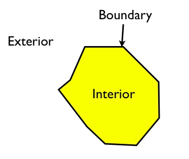

* The ``Interior`` is the part bounded by the rings;
* The ``Boundary`` is the rings themselves;
* The ``Exterior`` is everything else in the plane.

For linear features, the ``Interior``, ``Boundary`` and ``Exterior`` are less well-known:

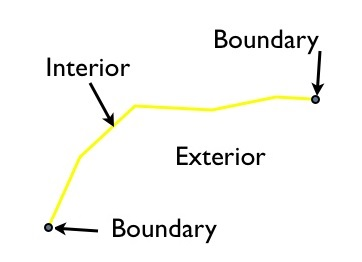

* The ``Interior`` is the part of the line bounded by the ends;
* The ``Boundary`` is the ends of the linear feature;
* The ``Exterior`` is everything else in the plane.

For points, things are even stranger:

* The ``Interior`` is the point;
* The ``Boundary`` is the empty set;
* The ``Exterior`` is everything else in the plane.

Using these definitions of interior, exterior and boundary, the relationships between any pair of spatial features can be characterized using the dimensionality of the nine possible intersections between the interiors/boundaries/exteriors of a pair of objects.

Dimensional Representation of Topological Interaction Between Spatial Oobjects
------------------------------------------------------------------------------

The Dimensionally Extended 9-Intersection Model (DE-9IM_) includes the intersection of Interiors, Boundaries, and Exteriors between a geometric object A and a geometric object B.

Depending on the type of geometric object, the dimensionality result can be of types: False (F) or empty (∅), 0 (dot), 1 (line), and 2 (polygon). Dimensionality True (T) or nonempty (∅) matches all results except False (F) or empty (∅).

In addition, this method employs the character ``*`` as for any possible result type (F, 0, 1, or 2).

.. image:: ./screenshots/de9im3.jpg
  :class: inline

For the polygons in the example above, the intersection of the interiors is a 2-dimensional area, so that portion of the matrix is filled out with a "2". The boundaries only intersect at points, which are zero-dimensional, so that portion of the matrix is filled out with a 0.

When there is no intersection between components, the square the matrix is filled out with an "F".

Here's another example, of a linestring partially entering a polygon:

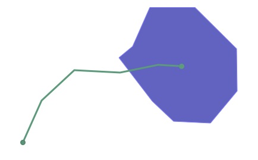

The DE9IM matrix for the interaction is this:

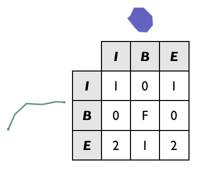

Note that the boundaries of the two objects don't actually intersect at all (the end point of the line interacts with the interior of the polygon, not the boundary, and vice versa), so the B/B cell is filled in with an "F". 

ST_Relate
---------

While it's fun to visually fill out DE9IM matrices, it would be nice if a computer could do it, and that's what the :command:`ST_Relate` function is for.

The previous example can be simplified using a simple box and line, with the same spatial relationship as our polygon and linestring:

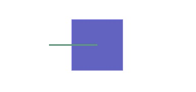

And we can generate the DE9IM information in SQL:

.. code-block:: sql

  SELECT ST_Relate(
           'LINESTRING(0 0, 2 0)',
           'POLYGON((1 -1, 1 1, 3 1, 3 -1, 1 -1))'
         );

The answer (1010F0212) is the same as we calculated visually, but returned as a 9-character string, with the first row, second row and third row of the table appended together.

::
  
  101
  0F0
  212

However, the power of DE9IM matrices is not in generating them, but in using them as a matching key to find geometries with very specific relationships to one another.

.. code-block:: sql

  CREATE TABLE lakes ( id serial primary key, geom geometry );
  CREATE TABLE docks ( id serial primary key, good boolean, geom geometry );

  INSERT INTO lakes ( geom ) 
    VALUES ( 'POLYGON ((100 200, 140 230, 180 310, 280 310, 390 270, 400 210, 320 140, 215 141, 150 170, 100 200))');

  INSERT INTO docks ( geom, good )
    VALUES 
	  ('LINESTRING (170 290, 205 272)',true),
	  ('LINESTRING (120 215, 176 197)',true),
	  ('LINESTRING (290 260, 340 250)',false),
	  ('LINESTRING (350 300, 400 320)',false),
	  ('LINESTRING (370 230, 420 240)',false),
	  ('LINESTRING (370 180, 390 160)',false);

Suppose we have a data model that includes **Lakes** and **Docks**, and suppose further that Docks must be inside lakes, and must touch the boundary of their containing lake at one end. Can we find all the docks in our database that obey that rule?

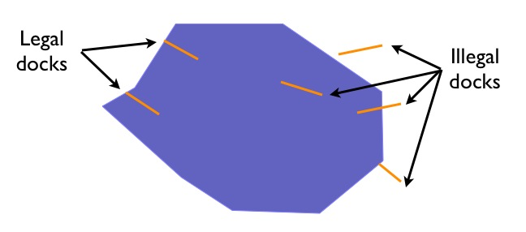

Our legal docks have the following characteristics:

* Their interiors have a linear (1D) intersection with the lake interior
* Their boundaries have a point (0D) intersection with the lake interior
* Their boundaries **also** have a point (0D) intersection with the lake boundary
* Their interiors have no intersection (F) with the lake exterior

So their DE9IM_ matrix looks like this:

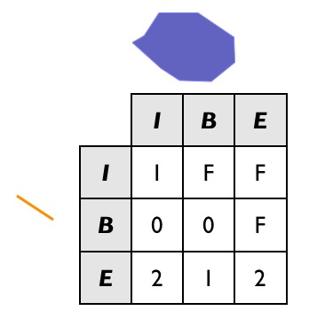

So to find all the legal docks, we would want to find all the docks that intersect lakes (a super-set of **potential** candidates we use for our join key), and then find all the docks in that set which have the legal relate pattern.

.. code-block:: sql

  SELECT docks.*
  FROM docks JOIN lakes ON ST_Intersects(docks.geom, lakes.geom)
  WHERE ST_Relate(docks.geom, lakes.geom, '1FF00F212');

  -- Answer: our two good docks

Note the use of the three-parameter version of :command:`ST_Relate`, which returns true if the pattern matches or false if it does not. For a fully-defined pattern like this one, the three-parameter version is not needed -- we could have just used a string equality operator.

However, for looser pattern searches, the three-parameter allows substitution characters in the pattern string:

* "*" means "any value in this cell is acceptable"
* "T" means "any non-false value (0, 1 or 2) is acceptable"

So for example, one possible dock we did not include in our example graphic is a dock with a two-dimensional intersection with the lake boundary:

.. code-block:: sql

  INSERT INTO docks ( geom, good )
    VALUES ('LINESTRING (140 230, 150 250, 210 230)',true);

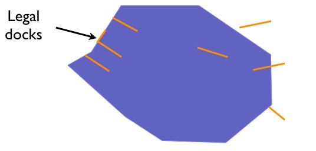

If we are to include this case in our set of "legal" docks, we need to change the relate pattern in our query. In particular, the intersection of the dock interior lake boundary can now be either 1 (our new case) or F (our original case). So we use the "*" catchall in the pattern.

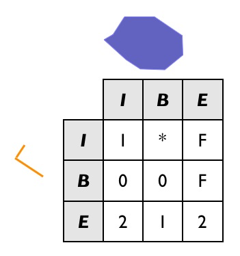

And the SQL looks like this:

.. code-block:: sql

  SELECT docks.*
  FROM docks JOIN lakes ON ST_Intersects(docks.geom, lakes.geom)
  WHERE ST_Relate(docks.geom, lakes.geom, '1*F00F212');

  -- Answer: our (now) three good docks

Confirm that the stricter SQL from the previous example does *not* return the new dock.

DE-9IM Spatial Relationships
============================

Clementini and Felice (1995) state that all possible relations applied in the CBM method can be represented using the DE-9IM model and all possible topological relationships between points, lines and polygons in a two-dimensional space. They can be grouped into five categories or topological relationships:

* Touch
* In(Within)
* Cross
* Overlap
* Disjoint

The SFSQL and the SQLMM specifications use the DE9IM model and these spatial relationships.

Therefore, the following equations and patterns may be possible under the DE-9IM model and its respective PostGIS-implemented topological relationships that implements the SFSQL/SQLMM specifications:

Touch (ST_Touches)
------------------

Applied for groups:

* polygon/polygon
* line/line
* line/polygon
* point/polygon
* point/line

〈A, touch, B〉 = [I (A) ∩ I (B) = ∅] and [B (A) ∩ I (B) ≠ ∅] or [I (A) ∩ B (B) ≠ or or [ B (A) ∩ B (B) ≠ ∅]

::

  DE-9IM matrix pattern : (F T * * * * * * *), (F * * T * * * * *), and (F * * * T * * * *)

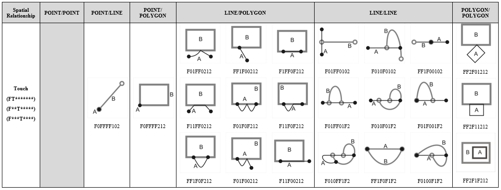

In (ST_Within/ST_Contains)
----------------------------

Applied to all groups:

* polygon/polygon
* line/line
* line/polygon
* point/polygon
* point/line
* point/point

〈A, in, B〉 = [I (A) ∩ I (B) e] and [I (A) ∩ E (B) = ∅] and [B (A) ∩ E (B) = ∅]

::

  DE-9IM matrix pattern : (T * F * * F * * *)

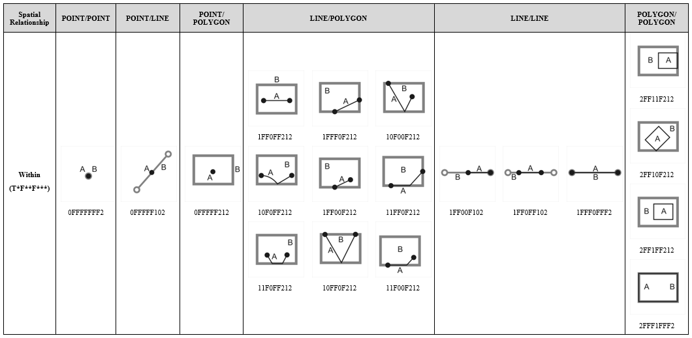

Cross (ST_Crosses)
------------------

Applied for groups:

* Line/Line

〈A, cross, B〉 = dim [I (A) ∩ I (B) = 0]

::

  DE-9IM matrix pattern : (0 * * * * * * * *)

* Line/Polygon:

〈A, cross, B〉 = [I (A) ∩ I (B) ≠ ∅] and [I (A) ∩ E (B) ≠ ∅]

::

  DE-9IM matrix pattern : (T * T * * * * * *)

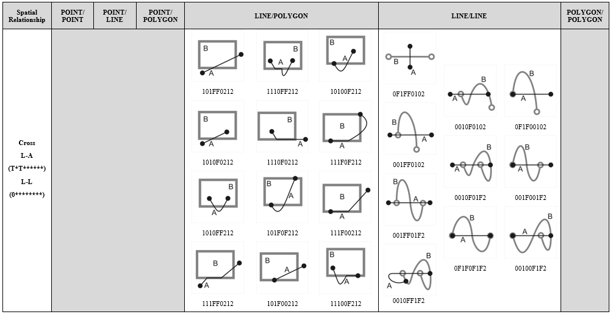

Overlap (ST_Overlaps)
---------------------

Applied for groups:

* Line/Line

〈A, overlap, B〉 = dim [I (A) ∩ I (B) = 1] and [I (A) ∩ E (B) ≠ ∅] and [E (A) ∩ I (B) ≠ ∅]

::

  DE-9IM matrix pattern : (1 * T * * * T * *)

* Polygon / Polygon:

〈A, overlay, B〉 = [I (A) ∩ I (B) ≠ ∅] and [I (A) ∩ E (B) ≠ ∅] and [E (A) ∩ I (B) ≠ ∅]

::

  DE-9IM matrix pattern : (T * T * * * T * *)

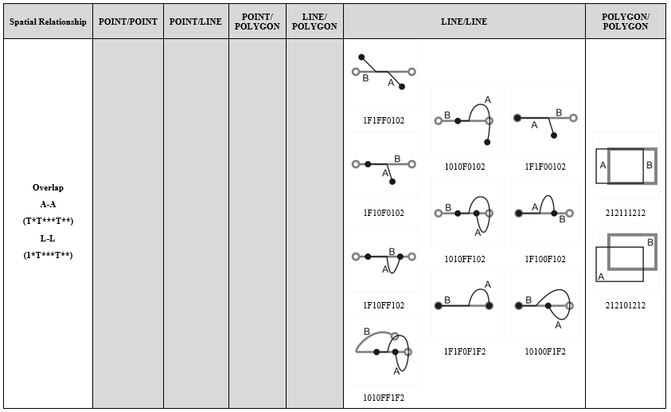

Disjoint (ST_Disjoint)
----------------------

Applied to all groups:

* polygon/polygon
* line/line
* line/polygon
* point/polygon
* point/line
* point/point

〈A, disjoint, B〉 = [I (A) ∩ I (B) = ∅] and [B (A) ∩ I (B) = ∅] and [I (A) ∩ B (B) = ∅] and [B (A) ∩ B (B) = ∅]

::

  DE-9IM matrix pattern : (F F * F F * * * *)

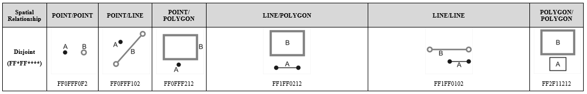

Data Quality Testing
====================

The TIGER data is carefully quality controlled when it is prepared, so we expect our data to meet strict standards. For example: no census block should overlap any other census block. Can we test for that?

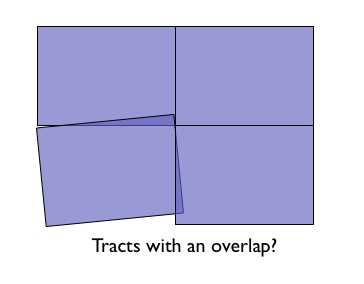

Sure!

.. code-block:: sql

  SELECT a.gid, b.gid 
  FROM nyc_census_blocks a, nyc_census_blocks b 
  WHERE ST_Intersects(a.geom, b.geom) 
    AND ST_Relate(a.geom, b.geom, '2********') 
    AND a.gid != b.gid
  LIMIT 10;

  -- Answer: 10, there's some funny business

Similarly, we would expect that the roads data is all end-noded. That is, we expect that intersections only occur at the ends of lines, not at the mid-points. 

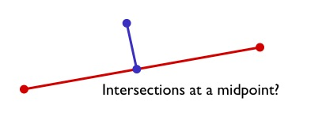

We can test for that by looking for streets that intersect (so we have a join) but where the intersection between the boundaries is not zero-dimensional (that is, the end points don't touch):

.. code-block:: sql

  SELECT a.gid, b.gid 
  FROM nyc_streets a, nyc_streets b 
  WHERE ST_Intersects(a.geom, b.geom) 
    AND NOT ST_Relate(a.geom, b.geom, '****0****') 
    AND a.gid != b.gid
  LIMIT 10;

  -- Answer: This happens, so the data is not end-noded.

Function List
-------------

ST_Relate_ (geometry A, geometry B): Returns a text string representing the DE9IM relationship between the geometries.

ST_Contains_ (geometry A, geometry B): Returns true if and only if no points of B lie in the exterior of A, and at least one point of the interior of B lies in the interior of A.

ST_Crosses_ (geometry A, geometry B): Returns TRUE if the supplied geometries have some, but not all, interior points in common.

ST_Disjoint_ (geometry A , geometry B): Returns TRUE if the Geometries do not "spatially intersect" - if they do not share any space together.

ST_Overlaps_ (geometry A, geometry B): Returns TRUE if the Geometries share space, are of the same dimension, but are not completely contained by each other.

ST_Touches_ (geometry A, geometry B): Returns TRUE if the geometries have at least one point in common, but their interiors do not intersect.

ST_Within_ (geometry A , geometry B): Returns true if the geometry A is completely inside geometry B

Reference
=========

* EGENHOFER, M. J.; CLEMENTINI, E.; FELICE, P. D. Topological relations between regions with holes. International Journal of Geographic Information Systems, v 8, n. 2, p. 129-142, 1994.
* EGENHOFER, M. J.; FRANZOSA, R. D. Point-set topological spatial relations. International Journal of Geographic Information Systems. v. 5, n. 2, p. 161-174, 1990.
* EGENHOFER, M. J.; HERRING, J. A mathematical framework for the definition of topological relationships. In: 4th INTERNATIONAL SYMPOSIUM ON SPATIAL DATA HANDLING, 4., 1991, Zürich, Switzerland. Proceedings…Zürich, Switzerland, 1991. p. 803-813.
* CLEMENTINI, E. A model for uncertain lines. Journal of Visual Languages and Computing 16, p. 271-288, 2005.
* CLEMENTINI, E.; DIFELICE, P.; VAN OOSTEROM, P. A small set of formal topological relationships suitable for end-user interaction. In: 3rd SYMPOSIUM ON SPATIAL DATABASE SYSTEMS, 3., 1993, Singapore. Proceedings…Singapore. 1993. p. 277-295.
* CLEMENTINI, E.; FELICE, P. D. A Comparison of Methods for Representing Topological Relationships. Information Sciences, v. 3, p. 149-178, 1995.
* CLEMENTINI, E.; FELICE, P. D. A model for representing topological relationships between complex geometric features in spatial databases. Information Sciences: an International Journal archive, v. 90, n. 1-4, 1996.
* CLEMENTINI, E.; FELICE, P. D. Approximate Topological Relations. International Journal of Approximate Reasoning, v. 16, n. 2, p. 173-204, 1997.
* CLEMENTINI, E.; FELICE, P. D. CALIFANO, G. Composite Regions In Topological Queries. Information Systems, v. 20, n. 7, p. 579-594, 1995.
* CLEMENTINI, E.; FELICE, P. D. KOPERSKI, K. Mining multiple-level spatial association rules for objects with a broad boundary. Data & Knowledge Engineering, v. 34, p. 251-270, 2000.
* CLEMENTINI, E.; FELICE, P. D. Topological Invariants for Lines. IEEE Transactions On Knowledge And Data Engineering, v. 10, n. 1, 1998.

.. _DE-9IM: http://en.wikipedia.org/wiki/DE-9IM

.. _SFSQL: http://www.opengeospatial.org/standards/sfa

.. _SQLMM: https://www.iso.org/standard/60343.html

.. _ST_Relate: http://postgis.net/docs/ST_Relate.html

.. _ST_Crosses: http://postgis.net/docs/ST_Crosses.html

.. _ST_Disjoint: http://postgis.net/docs/ST_Disjoint.html

.. _ST_Within: http://postgis.net/docs/ST_Within.html

.. _ST_Overlaps: http://postgis.net/docs/ST_Overlaps.html

.. _ST_Touches: http://postgis.net/docs/ST_Touches.html

