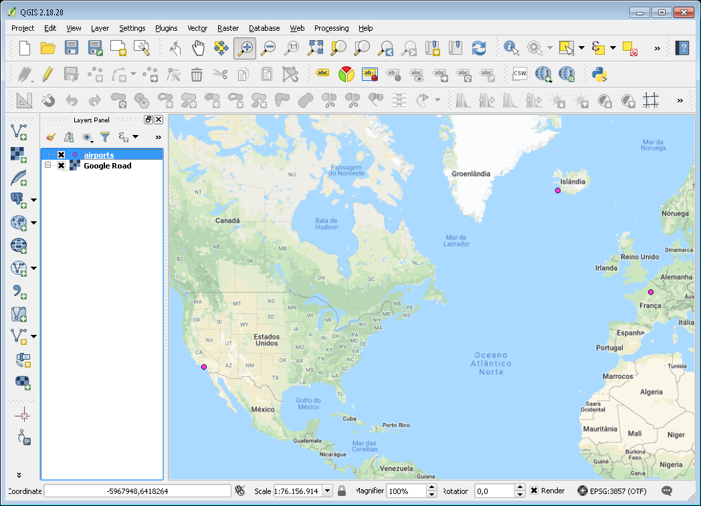
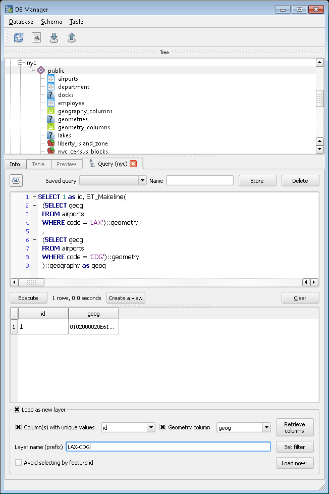
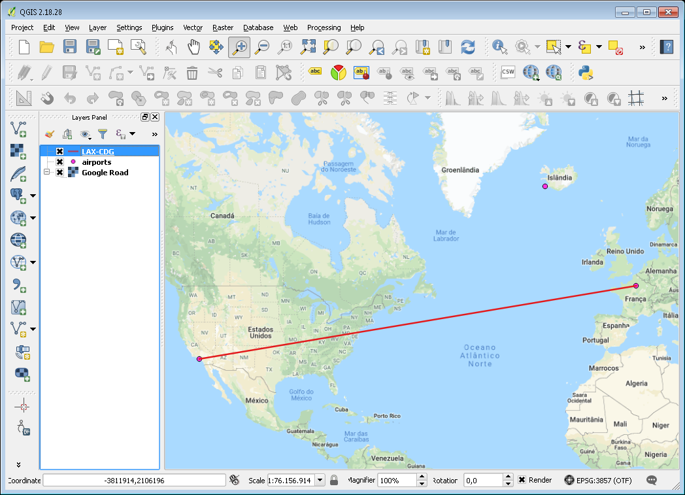

.. _geography:

Geography
=========

It is very common to have data in which the coordinate are "geographics" or "latitude/longitude". 

Unlike coordinates in Mercator, UTM, or Stateplane, geographic coordinates are **not Cartesian coordinates**. Geographic coordinates do not represent a linear distance from an origin as plotted on a plane.  Rather, these **spherical coordinates** describe angular coordinates on a globe. In spherical coordinates a point is specified by the angle of rotation from a reference meridian (longitude), and the angle from the equator (latitude).

.. image:: ./geography/cartesian_spherical.jpg
  :class: inline

You can treat geographic coordinates as approximate Cartesian coordinates and continue to do spatial calculations. However, measurements of distance, length and area will be nonsensical. Since spherical coordinates measure **angular** distance, the units are in "degrees." Further, the approximate results from indexes and true/false tests like intersects and contains can become terribly wrong. The distance between points get larger as problem areas like the poles or the international dateline are approached.

For example, here are the coordinates of Los Angeles and Paris.

* Los Angeles: ``POINT(-118.4079 33.9434)``
* Paris: ``POINT(2.3490 48.8533)``
 
The following calculates the distance between Los Angeles and Paris using the standard PostGIS Cartesian ST_Distance_(geometry, geometry).  Note that the SRID of 4326 declares a geographic spatial reference system.

.. code-block:: sql

  SELECT ST_Distance(
    ST_GeometryFromText('POINT(-118.4079 33.9434)', 4326), -- Los Angeles (LAX)
    ST_GeometryFromText('POINT(2.5559 49.0083)', 4326)     -- Paris (CDG)
    );

::

  121.898285970107
  
Aha! 121! But, what does that mean? 

The units for spatial reference 4326 are degrees. So our answer is 121 degrees. But (again), what does that mean? 

On a sphere, the size of one "degree square" is quite variable, becoming smaller as you move away from the equator. Think of the meridians (vertical lines) on the globe getting closer to each other as you go towards the poles. So, a distance of 121 degrees doesn't *mean* anything. It is a nonsense number.

In order to calculate a meaningful distance, we must treat geographic coordinates not as approximate Cartesian coordinates but rather as true spherical coordinates.  We must measure the distances between points as true paths over a sphere -- a portion of a great circle. 

Starting with version 1.5, PostGIS provides this functionality through the ``geography`` type.

.. note::

  Different spatial databases have different approaches for "handling geographics" 
  
  * Oracle attempts to paper over the differences by transparently doing geographic calculations when the SRID is geographic. 
  * SQL Server uses two spatial types, "STGeometry" for Cartesian data and "STGeography" for geographics. 
  * Informix Spatial is a pure Cartesian extension to Informix, while Informix Geodetic is a pure geographic extension. 
  * Similar to SQL Server, PostGIS uses two types, "geometry" and "geography".
  
Using the ``geography`` instead of ``geometry`` type, let's try again to measure the distance between Los Angeles and Paris. Instead of ST_GeometryFromText_ (text), we will use ST_GeographyFromText_ (text).

.. code-block:: sql

  SELECT ST_Distance(
    ST_GeographyFromText('POINT(-118.4079 33.9434)'), -- Los Angeles (LAX)
    ST_GeographyFromText('POINT(2.5559 49.0083)')     -- Paris (CDG)
    );

::

  9124665.26917268

A big number! All return values from ``geography`` calculations are in meters, so our answer is 9124km. 

Older versions of PostGIS supported very basic calculations over the sphere using the ST_Distance_Spheroid_ (point, point, measurement)` function. However, ST_Distance_Spheroid_ is substantially limited. The function only works on points and provides no support for indexing across the poles or international dateline.

The need to support non-point geometries becomes very clear when posing a question like "How close will a flight from Los Angeles to Paris come to Iceland?" 

.. image:: ./geography/lax_cdg.jpg

Working with geographic coordinates on a Cartesian plane (the purple line) yields a *very* wrong answer indeed! Using great circle routes (the red lines) gives the right answer. If we convert our LAX-CDG flight into a line string and calculate the distance to a point in Iceland using ``geography`` we'll get the right answer (recall) in meters.

.. code-block:: sql

  SELECT ST_Distance(
    ST_GeographyFromText('LINESTRING(-118.4079 33.9434, 2.5559 49.0083)'), -- LAX-CDG
    ST_GeographyFromText('POINT(-22.6056 63.9850)')                        -- Iceland (KEF)
  );

::

  502454.906643729
  
So the closest approach to Iceland (as measured from its international airport) on the LAX-CDG route is a relatively small 502km.
  
The Cartesian approach to handling geographic coordinates breaks down entirely for features that cross the international dateline. The shortest great-circle route from Los Angeles to Tokyo crosses the Pacific Ocean. The shortest Cartesian route crosses the Atlantic and Indian Oceans.

.. image:: ./geography/lax_nrt.png

.. code-block:: sql

   SELECT ST_Distance(
     ST_GeometryFromText('Point(-118.4079 33.9434)'),  -- LAX
     ST_GeometryFromText('Point(139.733 35.567)'))     -- NRT (Tokyo/Narita)
       AS geometry_distance, 
   ST_Distance(
     ST_GeographyFromText('Point(-118.4079 33.9434)'), -- LAX
     ST_GeographyFromText('Point(139.733 35.567)'))    -- NRT (Tokyo/Narita) 
       AS geography_distance; 
    
::

   geometry_distance | geography_distance 
  -------------------+--------------------
    258.146005837336 |   8833954.76996256

Using Geography
---------------

In order to load geometry data into a geography table, the geometry first needs to be projected into EPSG:4326 (longitude/latitude), then it needs to be changed into geography.  The ST_Transform_ (geometry,srid)` function converts coordinates to geographics and the Geography_ (geometry) function "casts" them from geometry to geography.

.. code-block:: sql

  CREATE TABLE nyc_subway_stations_geog AS
  SELECT 
    Geography(ST_Transform(geom,4326)) AS geog, 
    name, 
    routes
  FROM nyc_subway_stations;
   
Building a spatial index on a geography table is exactly the same as for geometry:

.. code-block:: sql

  CREATE INDEX nyc_subway_stations_geog_gix 
  ON nyc_subway_stations_geog USING GIST (geog);

The difference is under the covers: the geography index will correctly handle queries that cover the poles or the international date-line, while the geometry one will not.

There are only a small number of native functions for the geography type(postGIS 2.5):
 
* ST_Area_ - Returns the area of the surface if it is a Polygon or MultiPolygon. For geometry, a 2D Cartesian area is determined with units specified by the SRID. For geography, area is determined on a curved surface with units in square meters.
* ST_AsBinary_ - Return the Well-Known Binary (WKB) representation of the geometry/geography without SRID meta data.
* ST_AsEWKT_ - Return the Well-Known Text (WKT) representation of the geometry with SRID meta data.
* ST_AsGML_ - Return the geometry as a GML version 2 or 3 element.
* ST_AsGeoJSON_ - Return the geometry as a GeoJSON element.
* ST_AsKML_ - Return the geometry as a KML element. Several variants. Default version=2, default maxdecimaldigits=15
* ST_AsSVG_ - Returns a Geometry in SVG path data given a geometry or geography object.
* ST_AsText_ - Return the Well-Known Text (WKT) representation of the geometry/geography without SRID metadata.
* ST_Azimuth_ - Returns the north-based azimuth as the angle in radians measured clockwise from the vertical on pointA to pointB.
* ST_Buffer_ - (T)Returns a geometry covering all points within a given distancefrom the input geometry.
* ST_Centroid_ - Returns the geometric center of a geometry.
* ST_CoveredBy_ - Returns 1 (TRUE) if no point in Geometry/Geography A is outside Geometry/Geography B
* ST_Covers_ - Returns 1 (TRUE) if no point in Geometry B is outside Geometry A
* ST_DWithin_ - Returns true if the geometries are within the specified distance of one another. For geometry units are in those of spatial reference and for geography units are in meters and measurement is defaulted to use_spheroid=true (measure around spheroid), for faster check, use_spheroid=false to measure along sphere.
* ST_Distance_ - For geometry type returns the 2D Cartesian distance between two geometries in projected units (based on spatial reference system). For geography type defaults to return minimum geodesic distance between two geographies in meters.
* ST_GeogFromText_ - Return a specified geography value from Well-Known Text representation or extended (WKT).
* ST_GeogFromWKB_ - Creates a geography instance from a Well-Known Binary geometry representation (WKB) or extended Well Known Binary (EWKB).
* ST_GeographyFromText_ - Return a specified geography value from Well-Known Text representation or extended (WKT).
* `= <https://postgis.net/docs/ST_Geometry_EQ.html>`_ - Returns TRUE if the coordinates and coordinate order geometry/geography A are the same as the coordinates and coordinate order of geometry/geography B.
* ST_Intersection_ - (T)Returns a geometry that represents the shared portion of geomA and geomB.
* ST_Intersects_ - Returns TRUE if the Geometries/Geography "spatially intersect in 2D" - (share any portion of space) and FALSE if they don't (they are Disjoint). For geography -- tolerance is 0.00001 meters (so any points that close are considered to intersect)
* ST_Length_ - Returns the 2D length of the geometry if it is a LineString or MultiLineString. geometry are in units of spatial reference and geography are in meters (default spheroid)
* ST_Perimeter_ - Return the length measurement of the boundary of an ST_Surface or ST_MultiSurface geometry or geography. (Polygon, MultiPolygon). geometry measurement is in units of spatial reference and geography is in meters.
* ST_Project_ - Returns a POINT projected from a start point using a distance in meters and bearing (azimuth) in radians.
* ST_Segmentize_ - Return a modified geometry/geography having no segment longer than the given distance.
* ST_Summary_ - Returns a text summary of the contents of the geometry.
* `<-> <https://postgis.net/docs/geometry_distance_knn.html>`_ - Returns the 2D distance between A and B.
* `&& <https://postgis.net/docs/geometry_overlaps.html>`_ - Returns TRUE if A's 2D bounding box intersects B's 2D bounding box. 
 
 
Creating a Geography Table
--------------------------
 
The SQL for creating a new table with a geography column is much like that for creating a geometry table. However, geography includes the ability to specify the object type directly at the time of table creation. For example:

.. code-block:: sql

  CREATE TABLE airports (
    code VARCHAR(3),
    geog GEOGRAPHY(Point)
  );
  
  INSERT INTO airports VALUES ('LAX', 'POINT(-118.4079 33.9434)');
  INSERT INTO airports VALUES ('CDG', 'POINT(2.5559 49.0083)');
  INSERT INTO airports VALUES ('KEF', 'POINT(-22.6056 63.9850)');
  
In the table definition, the ``GEOGRAPHY(Point)`` specifies our airport data type as points. The new geography fields don't get registered in the ``geometry_columns`` view. Instead, they are registered in a view called ``geography_columns``.

.. code-block:: sql

  SELECT * FROM geography_columns;
  
::

           f_table_name    | f_geography_column | srid |   type   
 --------------------------+--------------------+------+----------
  nyc_subway_stations_geog | geog               |    0 | Geometry
  airports                 | geog               | 4326 | Point

.. note:: Some columns were omitted from the above output.

Casting to Geometry
-------------------

While the basic functions for geography types can handle many use cases, there are times when you might need access to other functions only supported by the geometry type. Fortunately, you can convert objects back and forth from geography to geometry.

The PostgreSQL syntax convention for casting is to append ``::typename`` to the end of the value you wish to cast. So, ``2::text`` with convert a numeric two to a text string '2'. And ``'POINT(0 0)'::geometry`` will convert the text representation of point into a geometry point.

The ST_X_(point) function only supports the geometry type. How can we read the X coordinate from our geographies?

.. code-block:: sql

  SELECT code, ST_X(geog::geometry) AS longitude FROM airports;

::

  code | longitude 
 ------+-----------
  LAX  | -118.4079 
  CDG  |    2.5559
  KEF  |  -21.8628

By appending ``::geometry`` to our geography value, we convert the object to a geometry with an SRID of 4326. From there we can use as many geometry functions as strike our fancy. But, remember -- now that our object is a geometry, the coordinates will be interpretted as Cartesian coordinates, not spherical ones.
 
 
Why (Not) Use Geography
-----------------------

Geographics are universally accepted coordinates -- everyone understands what latitude/longitude mean, but very few people understand what UTM coordinates mean. Why not use geography all the time?

* First, as noted earlier, there are far fewer functions available (right now) that directly support the geography type. You may spend a lot of time working around geography type limitations.
* Second, the calculations on a sphere are computationally far more expensive than Cartesian calculations. For example, the Cartesian formula for distance (Pythagoras) involves one call to sqrt(). The spherical formula for distance (Haversine) involves two sqrt() calls, an arctan() call, four sin() calls and two cos() calls. Trigonometric functions are very costly, and spherical calculations involve a lot of them.

The conclusion? 

**If your data is geographically compact** (contained within a state, county or city), **use the geometry type with a Cartesian projection** that makes sense with your data. See the http://spatialreference.org site and type in the name of your region for a selection of possible reference systems.

**If you need to measure distance with a dataset that is geographically dispersed** (covering much of the world), **use the geography type.** The application complexity you save by working in ``geography`` will offset any performance issues. And casting to ``geometry`` can offset most functionality limitations.

-----

.. note:: - The buffer and intersection functions are actually wrappers on top of a cast to geometry, and are not carried out natively in spherical coordinates. As a result, they may fail to return correct results for objects with very large extents that cannot be cleanly converted to a planar representation.
 
          - For example, the ST_Buffer_ (geography,distance) function transforms the geography object into a "best" projection, buffers it, and then transforms it back to geographics. If there is no "best" projection (the object is too large), the operation can fail or return a malformed buffer. 

-----

Visualizing Geography Data
--------------------------

You can use a GIS to view your geometry data, but to view your geography data you must be alert for some details, principally related to the projection used.

An easy way to view the shortest path between global airports is accessing the `Great Circle Mapper <http://www.gcmap.com/>`_ website.

  Open the airports table in QGIS.

Add some basemap (`QuickMapServices QGIS Plugin <https://plugins.qgis.org/plugins/quick_map_services/>`_) to the view to help you to visualize the airports data.

..

..

  Open the DB Manager, execute the SQL instruction below and insert the layer in the view as ``LAX-CDG``.
  
.. code-block:: sql

  SELECT 1 as id, ST_Makeline(
  (SELECT geog
  FROM airports
  WHERE code = 'LAX')::geometry
  ,
  (SELECT geog
  FROM airports
  WHERE code = 'CDG')::geometry
  )::geography as geog

..

..

The construction of the linear feature that presents the LAX-CDG air route was performed in some steps:

#. Two queries were used to acquire the geography features of LAX and CDG airports;

#. Casting of airport geography features to geometry type, as the spatial function ST_MakeLine_ (geometry, geometry) only works with geometry data and doesn't support geography data.

#. Generation of a geometry linear feature from two geometry points features representing LAX and CDG airports.

#. Casting of the geometry linear feature to geography linear feature.

..

..

Note that the LAX-CDG route, despite being in geography data format, presents a straight line as if the data were geometry.

This is because QGIS creates this "line" from the computational path between the two airports.

To solve this visualization "problem", it is necessary to "segmentize" the line-type geographic data by vertices that represent the path drawn between airports.

In this case, we will use the ST_Segmentize spatial function (geography geog, float max_segment_length), which has support for geography data, with line segmentation in vertices with 10m spacing between them.

.. code-block:: sql

  SELECT 1 as id,
  ST_Segmentize(

  ST_Makeline(

  (SELECT geog
  FROM airports
  WHERE code = 'LAX')::geometry

  ,

  (SELECT geog
  FROM airports
  WHERE code = 'CDG')::geometry

  )::geography

  ,10) as geog

..

  Add this new layer as LAX-CDG(geography).

..

..

Be aware that this procedure works to visualize linear geography features in GIS, but it´s not a good practice to calculate the distance between these points as can be seen in the query bellow:

.. code-block:: sql

  SELECT 'geography' as type,
  ST_Length(
  ST_Makeline(
  (SELECT geog
  FROM airports
  WHERE code = 'LAX')::geometry
  ,
  (SELECT geog
  FROM airports
  WHERE code = 'CDG')::geometry
  )::geography
  ) as distance

  UNION

  SELECT 'geometry' as type,
  ST_Length(
  ST_Segmentize(
  ST_Makeline(
  (SELECT geog
  FROM airports
  WHERE code = 'LAX')::geometry
  ,
  (SELECT geog
  FROM airports
  WHERE code = 'CDG')::geometry
  )::geography
  ,10)
  ) as distance;
..

::

     type    |     distance
  -----------+------------------
   geography | 9124665.27317673
   geometry  | 9124671.97516477
 
 ..

Function List
-------------

ST_Distance_ (geometry, geometry): For geometry type Returns the 2-dimensional Cartesian minimum distance (based on spatial ref) between two geometries in projected units. For geography type defaults to return spheroidal minimum distance between two geographies in meters.

ST_GeographyFromText_ (text): Returns a specified geography value from Well-Known Text representation or extended (WKT).

ST_Transform_ (geometry, srid): Returns a new geometry with its coordinates transformed to the SRID referenced by the integer parameter.

ST_X_ (point): Returns the X coordinate of the point, or NULL if not available. Input must be a point.

.. _ST_Distance: http://postgis.net/docs/ST_Distance.html

.. _ST_GeographyFromText: http://postgis.net/docs/ST_GeographyFromText.html

.. _ST_Transform: http://postgis.net/docs/ST_Transform.html

.. _ST_X: http://postgis.net/docs/ST_X.html

.. _ST_GeometryFromText: http://postgis.net/docs/ST_GeometryFromText.html

.. _ST_Distance_Spheroid: http://postgis.net/docs/ST_Distance_Spheroid.html

.. _ST_Buffer: http://postgis.net/docs/ST_Buffer.html

.. _ST_AsText: http://postgis.net/docs/ST_AsText.html

.. _ST_AsBinary: http://postgis.net/docs/ST_AsBinary.html

.. _ST_GeogFromWKB: http://postgis.net/docs/ST_GeogFromWKB.html

.. _ST_AsSVG: http://postgis.net/docs/ST_AsSVG.html

.. _ST_AsGML: http://postgis.net/docs/ST_AsGML.html

.. _ST_AsKML: http://postgis.net/docs/ST_AsKML.html

.. _ST_AsGeoJson: http://postgis.net/docs/ST_AsGeoJson.html

.. _ST_Distance: http://postgis.net/docs/ST_Distance.html

.. _ST_DWithin: http://postgis.net/docs/ST_DWithin.html

.. _ST_Area: http://postgis.net/docs/ST_Area.html

.. _ST_Length: http://postgis.net/docs/ST_Length.html

.. _ST_Covers: http://postgis.net/docs/ST_Covers.html

.. _ST_CoveredBy: http://postgis.net/docs/ST_CoveredBy.html

.. _ST_Intersects: http://postgis.net/docs/ST_Intersects.html

.. _ST_Intersection: http://postgis.net/docs/ST_Intersection.html

.. _ST_Azimuth: http://postgis.net/docs/ST_Azimuth.html

.. _ST_Centroid: http://postgis.net/docs/ST_Centroid.html

.. _ST_Perimeter: http://postgis.net/docs/ST_Perimeter.html

.. _ST_Project: http://postgis.net/docs/ST_Project.html

.. _ST_Segmentize: http://postgis.net/docs/ST_Segmentize.html

.. _ST_Summary: http://postgis.net/docs/ST_Summary.html

.. _ST_AsEWKT: http://postgis.net/docs/ST_AsEWKT.html

.. _ST_Makeline: http://postgis.net/docs/ST_MakeLine.html

