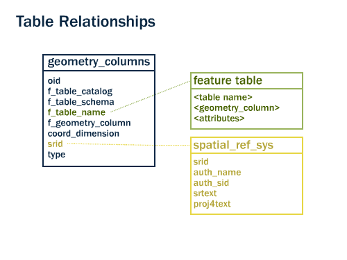
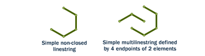
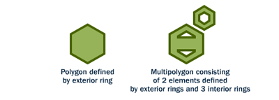
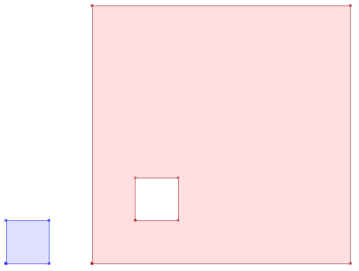
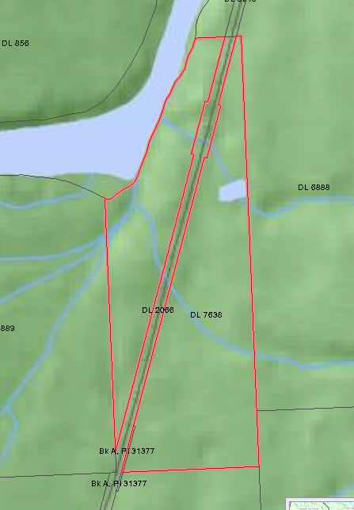
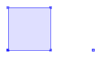

.. _geometries:

Geometries
==========

Introduction
------------

In the previous `section <./loading_data.rst>`_, we loaded a variety of data.

Before we start playing with our data lets have a look at some simpler examples.

  In pgAdmin, once again select the **nyc** database and open the SQL query tool.
  
  Paste this example SQL_ code into the pgAdmin SQL Editor window (removing any text that may be there by default) and then execute.

.. code-block:: sql

    CREATE TABLE geometries (id integer, name varchar, geom geometry);

    INSERT INTO geometries VALUES
    (1, 'Point', 'POINT(0 0)'),
    (2, 'Linestring', 'LINESTRING(0 0, 1 1, 2 1, 2 2)'),
    (3, 'Polygon', 'POLYGON((0 0, 1 0, 1 1, 0 1, 0 0))'),
    (4, 'PolygonWithHole', 'POLYGON((2 0, 12 0, 12 10, 2 10, 2 0),(3 1, 4 1, 4 2, 3 2, 3 1))'),
    (5, 'Collection', 'GEOMETRYCOLLECTION(POINT(2 1),POLYGON((5 3, 6 3, 6 4, 5 4, 5 3)))');

    SELECT id, name, ST_AsText(geom) FROM geometries;

::

   id |      name       |                           st_astext
  ----+-----------------+---------------------------------------------------------------
    1 | Point           | POINT(0 0)
    2 | Linestring      | LINESTRING(0 0,1 1,2 1,2 2)
    3 | Polygon         | POLYGON((0 0,1 0,1 1,0 1,0 0))
    4 | PolygonWithHole | POLYGON((2 0,12 0,12 10,2 10,2 0),(3 1,4 1,4 2,3 2,3 1))
    5 | Collection      | GEOMETRYCOLLECTION(POINT(2 1),POLYGON((5 3,6 3,6 4,5 4,5 3)))

The above example CREATEs a table (**geometries**) then INSERTs five geometries: a point, a line, a polygon, a polygon with a hole, and a collection. Finally, the inserted rows are SELECTed and displayed in the Output pane.

Metadata Tables
---------------

In conformance with the OpenGIS Implementation Specification for Geographic information-Simple feature access (SFSQL_) or by the ISO/IEC 13249-3:2016 Part 3: Spatial (SQLMM_), **PostGIS** provides two tables to track and report on the geometry types available in a given database.

* The first table, ``spatial_ref_sys``, defines all the spatial reference systems known to the database and will be described in greater detail later.
* The second table (actually, a view), ``geometry_columns``, provides a listing of all "features" (defined as an object with geometric attributes), and the basic details of those features.

Let's have a look at the ``geometry_columns`` table in our database.

  Paste this command in the Query Tool as before:

.. code-block:: sql

  SELECT * FROM geometry_columns;

::

   f_table_catalog | f_table_schema |    f_table_name     | f_geometry_column | coord_dimension | srid  |      type
  -----------------+----------------+---------------------+-------------------+-----------------+-------+-----------------
   nyc             | public         | nyc_census_blocks   | geom              |               2 | 26918 | MULTIPOLYGON
   nyc             | public         | nyc_homicides       | geom              |               2 | 26918 | POINT
   nyc             | public         | nyc_neighborhoods   | geom              |               2 | 26918 | MULTIPOLYGON
   nyc             | public         | nyc_streets         | geom              |               2 | 26918 | MULTILINESTRING
   nyc             | public         | nyc_subway_stations | geom              |               2 | 26918 | POINT
   nyc             | public         | geometries          | geom              |               2 |     0 | GEOMETRY

* ``f_table_catalog``, ``f_table_schema``, and ``f_table_name`` provide the fully qualified name of the feature table containing a given geometry.  Because PostgreSQL doesn't make use of catalogs, ``f_table_catalog`` will tend to be empty.
* ``f_geometry_column`` is the name of the column that geometry containing column -- for feature tables with multiple geometry columns, there will be one record for each.
* ``coord_dimension`` and ``srid`` (SRID_) define the the dimension of the geometry (2-, 3- or 4-dimensional) and the Spatial Reference system identifier that refers to the ``spatial_ref_sys`` table respectively.
* The ``type`` column defines the type of geometry as described below; we've seen Point and Linestring types so far.

By querying this table, GIS clients and libraries can determine what to expect when retrieving data and can perform any necessary projection, processing or rendering without needing to inspect each geometry.

-----

.. note:: - Do some or all of your ``nyc`` tables not have an ``srid`` of 26918? It's easy to fix by updating the table

-----

.. code-block:: sql

      SELECT UpdateGeometrySRID('nyc_neighborhoods','geom',26918);

Representing Real World Objects
-------------------------------

The OpenGIS Implementation Specification for Geographic information-Simple feature access (SFSQL_), the original guiding standard for PostGIS development, defines how a real world object is represented.  By taking a continuous shape and digitizing it at a fixed resolution we achieve a passable representation of the object. 

SFSQL_ only handled 2-dimensional representations.  PostGIS has extended that to include 3- and 4-dimensional representations; more recently the SQL-Multimedia Part 3 (SQLMM_) specification has officially defined their own representation.

Our example table contains a mixture of different geometry types. We can collect general information about each object using functions that read the geometry metadata.

* ST_GeometryType_ (geometry) returns the type of the geometry
* ST_NDims_ (geometry) returns the number of dimensions of the geometry
* ST_SRID_ (geometry) returns the spatial reference identifier number of the geometry

.. code-block:: sql

    SELECT name, ST_GeometryType(geom), ST_NDims(geom), ST_SRID(geom)
    FROM geometries;

::

       name       |    st_geometrytype    | st_ndims | st_srid
 -----------------+-----------------------+----------+---------
  Point           | ST_Point              |        2 |       0
  Polygon         | ST_Polygon            |        2 |       0
  PolygonWithHole | ST_Polygon            |        2 |       0
  Collection      | ST_GeometryCollection |        2 |       0
  Linestring      | ST_LineString         |        2 |       0

Points
~~~~~~

.. image:: ./introduction/points.png
  :align: center
  :class: inline

A spatial **point** represents a single location on the Earth. This point is represented by a single coordinate (including either 2-, 3- or 4-dimensions).  Points are used to represent objects when the exact details, such as shape and size, are not important at the target scale.  For example, cities on a map of the world can be described as points, while a map of a single state might represent cities as polygons.

.. code-block:: sql

    SELECT ST_AsText(geom)
    FROM geometries
    WHERE name = 'Point';

::

   st_astext
  ------------
   POINT(0 0)

Some of the specific spatial functions for working with points are:

* ST_X_ (geometry) returns the X ordinate
* ST_Y_ (geometry) returns the Y ordinate

So, we can read the ordinates from a point like this:

.. code-block:: sql

  SELECT ST_X(geom), ST_Y(geom)
  FROM geometries
  WHERE name = 'Point';
  
::

   st_x | st_y
  ------+------
      0 |    0

The New York City subway stations (``nyc_subway_stations``) table is a data set represented as points. The following SQL_ query will return the geometry associated with one point (in the ST_AsText_ column).

.. code-block:: sql

    SELECT name, ST_AsText(geom)
    FROM nyc_subway_stations
    LIMIT 1;

::

       name     |                st_astext
  --------------+------------------------------------------
   Cortlandt St | POINT(583521.854408956 4507077.86259909)

Linestrings
~~~~~~~~~~~

A **linestring** is a path between locations.  It takes the form of an ordered series of two or more points.  Roads and rivers are typically represented as linestrings.  A linestring is said to be **closed** if it starts and ends on the same point.  It is said to be **simple** if it does not cross or touch itself (except at its endpoints if it is closed).  A linestring can be both **closed** and **simple**.

The street network for New York (``nyc_streets``) was loaded earlier in the workshop.  This dataset contains details such as name, and type.  A single real world street may consist of many linestrings, each representing a segment of road with different attributes.

The following SQL_ query will return the geometry associated with one linestring (in the ST_AsText_ column).

.. code-block:: sql

    SELECT ST_AsText(geom)
    FROM geometries
    WHERE name = 'Linestring';

::

            st_astext
  -----------------------------
   LINESTRING(0 0,1 1,2 1,2 2)

Some of the specific spatial functions for working with linestrings are:

* ST_Length_ (geometry) returns the length of the linestring
* ST_StartPoint_ (geometry) returns the first coordinate as a point
* ST_EndPoint_ (geometry) returns the last coordinate as a point
* ST_NPoints_ (geometry) returns the number of coordinates in the linestring

So, the length of our linestring is:

.. code-block:: sql

  SELECT ST_Length(geom)
  FROM geometries
  WHERE name = 'Linestring';

::

      st_length
  ------------------
   3.41421356237309

Polygons
~~~~~~~~

A polygon is a representation of an area. The outer boundary of the polygon is represented by a ring.

This ring is a linestring that is both closed and simple as defined above. Holes within the polygon are also represented by rings.

Polygons are used to represent objects whose size and shape are important. City limits, parks, building footprints or bodies of water are all commonly represented as polygons when the scale is sufficiently high to see their area.  Roads and rivers can sometimes be represented as polygons.

The following SQL query will return the geometry associated with one linestring (in the ST_AsText_ column).

.. code-block:: sql

  SELECT ST_AsText(geom)
  FROM geometries
  WHERE name LIKE 'Polygon%';
  
::

                          st_astext
  ----------------------------------------------------------
   POLYGON((0 0,1 0,1 1,0 1,0 0))
   POLYGON((2 0,12 0,12 10,2 10,2 0),(3 1,4 1,4 2,3 2,3 1))

--------

.. note:: - Rather than using an ``=`` sign in our ``WHERE`` clause, we are using the ``LIKE`` operator to carry out a string matching operation. You may be used to the ´´ * ´´ symbol as a glob_ for pattern matching, but in SQL_ the ``%`` symbol is used**, along with the ``LIKE`` operator to tell the system to do globbing_.

--------

The first polygon has only one ring. The second one has an interior "hole". Most graphics systems include the concept of a "polygon", but GIS systems are relatively unique in allowing polygons to explicitly have holes.

Some of the specific spatial functions for working with polygons are:

* ST_Area_ (geometry) returns the area of the polygons
* ST_NRings_ (geometry) returns the number of rings (usually 1, more of there are holes)
* ST_ExteriorRing_ (geometry) returns the outer ring as a linestring
* ST_InteriorRingN_ (geometry,n) returns a specified interior ring as a linestring
* ST_Perimeter_ (geometry) returns the length of all the rings

We can calculate the area of our polygons using the area function:

.. code-block:: sql

  SELECT name, ST_Area(geom)
  FROM geometries
  WHERE name LIKE 'Polygon%';

::

        name       | st_area
  -----------------+---------
   Polygon         |       1
   PolygonWithHole |      99

Note that the polygon with a hole has an area that is the area of the outer shell (a 10x10 square) minus the area of the hole (a 1x1 square).

Collections
~~~~~~~~~~~

There are four collection types, which group multiple simple geometries into sets.

* **MultiPoint**, a collection of points
* **MultiLineString**, a collection of linestrings
* **MultiPolygon**, a collection of polygons
* **GeometryCollection**, a heterogeneous collection of any geometry (including other collections)

Collections are another concept that shows up in GIS software more than in generic graphics software. They are useful for directly modeling real world objects as spatial objects. For example, how to model a lot that is split by a right-of-way? As a **MultiPolygon**, with a part on either side of the right-of-way.

Our example collection contains a polygon and a point:

.. code-block:: sql

  SELECT name, ST_AsText(geom)
  FROM geometries
  WHERE name = 'Collection';

::

      name    |                           st_astext
  ------------+---------------------------------------------------------------
   Collection | GEOMETRYCOLLECTION(POINT(2 1),POLYGON((5 3,6 3,6 4,5 4,5 3)))

Some of the specific spatial functions for working with collections are:

* ST_NumGeometries_ (geometry) returns the number of parts in the collection
* ST_GeometryN_ (geometry,n) returns the specified part
* ST_AsText_ (geometry) returns the total area of all polygonal parts
* ST_Length_ (geometry) returns the total length of all linear parts

Geometry Input and Output
-------------------------

Within the database, geometries are stored on disk in a format only used by the PostGIS program. In order for external programs to insert and retrieve useful geometries, they need to be converted into a format that other applications can understand. Fortunately, PostGIS supports emitting and consuming geometries in a large number of formats:

* Well-known text (WKT_)

  * ST_GeomFromText_ (text, srid) returns ``geometry``
  * ST_AsText_ (geometry) returns ``text``
  * ST_AsEWKT_ (geometry) returns ``text``

* Well-known binary (WKB_)

  * ST_GeomFromWKB_ (bytea) returns ``geometry``
  * ST_AsBinary_ (geometry) returns ``bytea``
  * ST_AsEWKB_ (geometry) returns ``bytea``

* Geographic Mark-up Language (GML_)

  * ST_GeomFromGML_ (text) returns ``geometry``
  * ST_AsGML_ (geometry) returns ``text``

* Keyhole Mark-up Language (KML_)

  * ST_GeomFromKML_ (text) returns ``geometry``
  * ST_AsKML_ (geometry) returns ``text``

* GeoJSON_

  * ST_AsGeoJSON_ (geometry) returns ``text``

* Scalable Vector Graphics (SVG_)

  * ST_AsSVG_ (geometry) returns ``text``

The most common use of a constructor is to turn a text representation of a geometry into an internal representation:

.. code-block::sql

  SELECT ST_GeomFromText('POINT(583571 4506714)',26918);
  
                    st_geomfromtext
  ----------------------------------------------------
   0101000020266900000000000026CF21410000008016315141

Note that in addition to a text parameter with a geometry representation, we also have a numeric parameter providing the SRID_ of the geometry.

The following SQL query shows an example of WKB_ representation (the call to encode_() is required to convert the binary output into an ASCII form for printing):

.. code-block:: sql

  SELECT encode(
    ST_AsBinary(ST_GeometryFromText('LINESTRING(0 0,1 0)')),
    'hex');

::

                                         encode
  ------------------------------------------------------------------------------------
   01020000000200000000000000000000000000000000000000000000000000f03f0000000000000000

For the purposes of this workshop we will continue to use WKT_ to ensure you can read and understand the geometries we're viewing.  However, most actual processes, such as viewing data in a GIS application, transferring data to a web service, or processing data remotely, WKB_ is the format of choice.

Since WKT and WKB were defined in the SFSQL_ specification, they do not handle 3- or 4-dimensional geometries.  For these cases PostGIS has defined the Extended Well Known Text (EWKT_) and Extended Well Known Binary (EWKB_) formats.  These provide the same formatting capabilities of WKT_ and WKB_ with the added dimensionality.

Here is an example of a 3D linestring in WKT_:

.. code-block:: sql

  SELECT ST_AsText(ST_GeometryFromText('LINESTRING(0 0 0,1 0 0,1 1 2)'));

::

              st_astext
  ----------------------------------
   LINESTRING Z (0 0 0,1 0 0,1 1 2)

Note that the text representation changes! This is because the text input routine for PostGIS is liberal in what it consumes. It will consume

* hex-encoded EWKB_,
* extended well-known text (EWKT_), and
* ISO standard well-known text (WKT_).

On the output side, the ST_AsText_ function is conservative, and only emits ISO standard well-known text.

In addition to the ST_GeomFromText_ function, there are many other ways to create geometries from well-known text or similar formatted inputs:

- Using ST_GeomFromText_ with the SRID_ parameter

.. code-block:: sql

  SELECT ST_GeomFromText('POINT(2 2)',4326);

- Using ST_GeomFromText_ without the SRID_ parameter
  
.. code-block:: sql

  SELECT ST_SetSRID(ST_GeomFromText('POINT(2 2)'),4326);
  
- Using a ST_MakePoint_ function

.. code-block:: sql
  
  SELECT ST_SetSRID(ST_MakePoint(2, 2), 4326);

- Using PostgreSQL casting syntax and ISO WKT_

.. code-block:: sql

  SELECT ST_SetSRID('POINT(2 2)'::geometry, 4326);

- Using PostgreSQL casting syntax and Extended WKT (EWKT_)

.. code-block:: sql

  SELECT 'SRID=4326;POINT(2 2)'::geometry;

In addition to emitters for the various forms (WKT_, WKB_, GML_, KML_, JSON_, SVG_), PostGIS also has consumers for four (WKT_, WKB_, GML_, KML_). Most applications use the WKT_ or WKB_ geometry creation functions, but the others work too. Here's an example that consumes GML_ and output JSON_:

.. code-block:: sql

  SELECT ST_AsGeoJSON(ST_GeomFromGML('<gml:Point><gml:coordinates>1,1</gml:coordinates></gml:Point>'));

::

               st_asgeojson
  --------------------------------------
   {"type":"Point","coordinates":[1,1]}

Casting from Text
-----------------

The WKT_ strings we've see so far have been of type 'text' and we have been converting them to type 'geometry' using PostGIS functions like ST_GeomFromText_ ().

PostgreSQL includes a short form syntax that allows data to be converted from one type to another, the casting syntax, `oldata::newtype`. So for example, this SQL_ converts a double into a text string.

.. code-block:: sql

  SELECT 0.9::text;

::

   text
  ------
   0.9

Less trivially, this SQL_ converts a WKT_ string into a geometry:

.. code-block:: sql

  SELECT 'POINT(0 0)'::geometry;
  
::

                    geometry
  --------------------------------------------
   010100000000000000000000000000000000000000

One thing to note about using casting to create geometries: unless you specify the SRID_, you will get a geometry with an unknown SRID_. You can specify the SRID_ using the "Extended" Well-Known Text (EWKT_) form, which includes an SRID_ block at the front:

.. code-block:: sql

  SELECT 'SRID=4326;POINT(0 0)'::geometry;

::

                        geometry
  ----------------------------------------------------
   0101000020E610000000000000000000000000000000000000
 
It's very common to use the casting notation when working with WKT_, as well as ``geometry`` and ``geography`` columns.

Function List
-------------

ST_Area_ : Returns the area of the surface if it is a polygon or multi-polygon. For ``geometry`` type area is in SRID_ units. For ``geography`` area is in square meters.

ST_AsText_ : Returns the Well-Known Text (WKT_) representation of the geometry/geography without SRID_ metadata.

ST_AsBinary_ : Returns the Well-Known Binary (WKB_) representation of the geometry/geography without SRID_ meta data.

ST_EndPoint_ : Returns the last point of a LINESTRING geometry as a POINT.

ST_AsEWKB_ : Returns the Well-Known Binary (WKB_) representation of the geometry with SRID_ meta data.

ST_AsEWKT_  : Returns the Well-Known Text (WKT_) representation of the geometry with SRID_ meta data.

ST_AsGeoJSON_ : Returns the geometry as a GeoJSON_ element.

ST_AsGML_ : Returns the geometry as a GML_ version 2 or 3 element.

ST_AsKML_ : Returns the geometry as a KML_ element. Several variants. Default version=2, default precision=15.

ST_AsSVG_ : Returns a Geometry in SVG_ path data given a geometry or geography object.

ST_ExteriorRing_ : Returns a line string representing the exterior ring of the POLYGON geometry. Return NULL if the geometry is not a polygon. Will not work with MULTIPOLYGON

ST_GeometryN_ : Returns the 1-based Nth geometry if the geometry is a GEOMETRYCOLLECTION, MULTIPOINT, MULTILINESTRING, MULTICURVE or MULTIPOLYGON. Otherwise, return NULL.

ST_GeomFromGML_ : Takes as input GML_ representation of geometry and outputs a PostGIS geometry object.

ST_GeomFromKML_ : Takes as input KML_ representation of geometry and outputs a PostGIS geometry object

ST_GeomFromText_ : Returns a specified ST_Geometry value from Well-Known Text representation (WKT_).

ST_GeomFromWKB_ : Creates a geometry instance from a Well-Known Binary geometry representation (WKB_) and optional SRID_.

ST_GeometryType_ : Returns the geometry type of the ST_Geometry value.

ST_InteriorRingN_ : Returns the Nth interior linestring ring of the polygon geometry. Return NULL if the geometry is not a polygon or the given N is out of range.

ST_Length_ : Returns the 2d length of the geometry if it is a linestring or multilinestring. geometry are in units of spatial reference and geography are in meters (default spheroid)

ST_MakePoint_ : Creates a 2D, 3DZ or 4D point geometry (geometry with measure). ST_MakePoint_ while not being OGC compliant is generally faster and more precise than ST_GeomFromText_ and ST_PointFromText. It is also easier to use if you have raw coordinates rather than WKT_.

ST_NDims_ : Returns coordinate dimension of the geometry as a small int. Values are: 2,3 or 4.

ST_NPoints_ : Returns the number of points (vertexes) in a geometry.

ST_NRings_ : If the geometry is a polygon or multi-polygon returns the number of rings.

ST_NumGeometries_ : If geometry is a GEOMETRYCOLLECTION (or MULTI*) returns the number of geometries, otherwise return NULL.

ST_Perimeter_ : Returns the length measurement of the boundary of an ST_Surface or ST_MultiSurface value. (Polygon, Multipolygon)

ST_SRID_ : Returns the spatial reference identifier for the ST_Geometry as defined in spatial_ref_sys table.

ST_StartPoint_ : Returns the first point of a LINESTRING geometry as a POINT.

ST_X_ : Returns the X coordinate of the point, or NULL if not available. Input must be a point.

ST_Y_ : Returns the Y coordinate of the point, or NULL if not available. Input must be a point.

.. _SQL: https://en.wikipedia.org/wiki/SQL

.. _Encode: https://en.wikipedia.org/wiki/Character_encoding

.. _glob: https://en.wikipedia.org/wiki/Glob_%28programming%29

.. _globbing: https://en.wikipedia.org/wiki/Glob_%28programming%29

.. _SFSQL: http://www.opengeospatial.org/standards/sfa

.. _SQLMM: https://www.iso.org/standard/60343.html

.. _WKT: https://en.wikipedia.org/wiki/Well-known_text_representation_of_geometry

.. _WKB: https://en.wikipedia.org/wiki/Well-known_binary

.. _GML: https://en.wikipedia.org/wiki/Geography_Markup_Language

.. _KML: https://en.wikipedia.org/wiki/Keyhole_Markup_Language

.. _JSON: https://en.wikipedia.org/wiki/JSON

.. _GeoJSON: https://en.wikipedia.org/wiki/GeoJSON

.. _SVG: https://en.wikipedia.org/wiki/Scalable_Vector_Graphics

.. _EWKT: https://en.wikipedia.org/wiki/Well-known_text_representation_of_geometry#Format_variations

.. _EWKB: https://en.wikipedia.org/wiki/Well-known_text_representation_of_geometry#Format_variations

.. _SRID: https://en.wikipedia.org/wiki/Spatial_reference_system

.. _ST_Area: http://postgis.net/docs/ST_Area.html 

.. _ST_AsText: http://postgis.net/docs/ST_AsText.html

.. _ST_AsBinary: http://postgis.net/docs/ST_AsBinary.html

.. _ST_EndPoint: http://postgis.net/docs/ST_EndPoint.html

.. _ST_AsEWKB: http://postgis.net/docs/ST_AsEWKB.html

.. _ST_AsEWKT: http://postgis.net/docs/ST_AsEWKT.html

.. _ST_AsGeoJSON: http://postgis.net/docs/ST_AsGeoJSON.html

.. _ST_AsGML: http://postgis.net/docs/ST_AsGML.html

.. _ST_AsKML: http://postgis.net/docs/ST_AsKML.html

.. _ST_AsSVG: http://postgis.net/docs/ST_AsSVG.html

.. _ST_ExteriorRing: http://postgis.net/docs/ST_ExteriorRing.html

.. _ST_GeometryN: http://postgis.net/docs/ST_GeometryN.html

.. _ST_GeomFromGML: http://postgis.net/docs/ST_GeomFromGML.html

.. _ST_GeomFromKML: http://postgis.net/docs/ST_GeomFromKML.html

.. _ST_GeomFromText: http://postgis.net/docs/ST_GeomFromText.html

.. _ST_GeomFromWKB: http://postgis.net/docs/ST_GeomFromWKB.html

.. _ST_GeometryType: http://postgis.net/docs/ST_GeometryType.html

.. _ST_InteriorRingN: http://postgis.net/docs/ST_InteriorRingN.html

.. _ST_Length: http://postgis.net/docs/ST_Length.html

.. _ST_MakePoint: https://postgis.net/docs/ST_MakePoint.html

.. _ST_NDims: http://postgis.net/docs/ST_NDims.html

.. _ST_NPoints: http://postgis.net/docs/ST_NPoints.html

.. _ST_NRings: http://postgis.net/docs/ST_NRings.html

.. _ST_NumGeometries: http://postgis.net/docs/ST_NumGeometries.html

.. _ST_Perimeter: http://postgis.net/docs/ST_Perimeter.html

.. _ST_SRID: http://postgis.net/docs/ST_SRID.html

.. _ST_StartPoint: http://postgis.net/docs/ST_StartPoint.html

.. _ST_X: http://postgis.net/docs/ST_X.html

.. _ST_Y: http://postgis.net/docs/ST_Y.html
