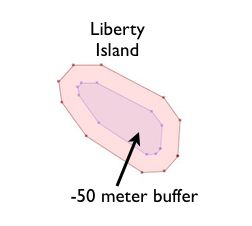

.. _geometry_returning:

Geometry Constructing Functions
===============================

All the functions we have seen so far work with geometries "as they are" and returns
 
* analyses of the objects (ST_Length_ (geometry), ST_Area_ (geometry)), 
* serializations of the objects (ST_AsText_ (geometry), ST_AsGML_ (geometry)), 
* parts of the object (ST_RingN_ (geometry,n)) or 

"Geometry constructing functions" take geometries as inputs and output new shapes.

ST_Centroid / ST_PointOnSurface
-------------------------------

A common need when composing a spatial query is to replace a polygon feature with a point representation of the feature.

* ST_Centroid_ (geometry) returns a point that is approximately on the center of mass of the input argument. This simple calculation is very fast, but sometimes not desirable, because the returned point is not necessarily in the feature itself. If the input feature has a convexity (imagine the letter 'C') the returned centroid might not be in the interior of the feature.
* ST_PointOnSurface_ (geometry) returns a point that is guaranteed to be inside the input argument. It is substantially more computationally expensive than the centroid operation.
 
.. image:: ./geometry_returning/centroid.jpg
  :class: inline

ST_Buffer
---------

The buffering operation is common in GIS workflows, and is also available in PostGIS. ST_Buffer_ (geometry,distance) takes in a buffer distance and geometry type and outputs a polygon with a boundary the buffer distance away from the input geometry.

.. image:: ./geometry_returning/st_buffer.png
  :class: inline

For example, if the US Park Service wanted to enforce a marine traffic zone around Liberty Island, they might build a 500 meter buffer polygon around the island. Liberty Island is a single census block in our ``nyc_census_blocks`` table, so we can easily extract and buffer it.

.. code-block:: sql

  -- Make a new table with a Liberty Island 500m buffer zone
  CREATE TABLE liberty_island_zone AS
  SELECT ST_Buffer(geom,500)::geometry(Polygon,26918) AS geom
  FROM nyc_census_blocks
  WHERE blkid = '360610001001001';

.. image:: ./geometry_returning/liberty_positive.jpg
  :class: inline

The :command:`ST_Buffer` function also accepts negative distances and builds inscribed polygons within polygonal inputs. For lines and points you will just get an empty return.

ST_Intersection
---------------

Another classic GIS operation -- the "overlay" -- creates a new coverage by calculating the intersection of two superimposed polygons. The resultant has the property that any polygon in either of the parents can be built by merging polygons in the resultant.

The ST_Intersection_ (geometry A, geometry B) function returns the spatial area (or line, or point) that both arguments have in common. If the arguments are disjoint, the function returns an empty geometry.

.. code-block:: sql

  -- What is the area these two circles have in common?
  -- Using ST_Buffer to make the circles!
  
  SELECT ST_AsText(ST_Intersection(
    ST_Buffer('POINT(0 0)', 2),
    ST_Buffer('POINT(3 0)', 2)
  ));

.. image:: ./geometry_returning/intersection.jpg
  :class: inline

ST_Union
--------

In the previous example we intersected geometries, creating a new geometry that had lines from both the inputs. The ST_Union_ does the reverse; it takes inputs and removes common lines. There are two forms of the ST_Union_ function: 

* ST_Union_ (geometry, geometry): A two-argument version that takes in two geometries and returns the merged union.

For example, our two-circle example from the previous section looks like this when you replace the intersection with a union.
 
  .. code-block:: sql

    -- What is the total area these two circles cover?
    -- Using ST_Buffer to make the circles!
 
    SELECT ST_AsText(ST_Union(
      ST_Buffer('POINT(0 0)', 2),
      ST_Buffer('POINT(3 0)', 2)
    ));
  
  .. image:: ./geometry_returning/union.jpg
    :class: inline
   

* ST_Union_ ([geometry]): An aggregate version that takes in a set of geometries and returns the merged geometry for the entire group. The aggregate ST_Union can be used with the ``GROUP BY`` SQL statement to create carefully merged subsets of basic geometries. It is very powerful,
 
As an example of ST_Union_ aggregation, consider our ``nyc_census_blocks`` table. Census geography is carefully constructed so that larger geographies can be built up from smaller ones. So, we can create a census tracts map by merging the blocks that form each tract. Or, we can create a county map by merging blocks that fall within each county.

To carry out the merge, note that the unique key ``blkid`` actually embeds information about the higher level geographies. Here are the parts of the key for Liberty Island we used earlier:

::

  360610001001001 = 36 061 000100 1 001
  
  36     = State of New York
  061    = New York County (Manhattan)
  000100 = Census Tract
  1      = Census Block Group
  001    = Census Block

  
So, we can create a county map by merging all geometries that share the same first 5 digits of their ``blkid``. Be patient; this is computationally expensive and can take a minute or two.

.. code-block:: sql

  -- Create a nyc_census_counties table by merging census blocks
  CREATE TABLE nyc_census_counties AS
  SELECT 
    ST_Union(geom)::Geometry(MultiPolygon,26918) AS geom, 
    SubStr(blkid,1,5) AS countyid
  FROM nyc_census_blocks
  GROUP BY countyid;
  
.. image:: ./geometry_returning/union_counties.png
  :class: inline

An area test can confirm that our union operation did not lose any geometry. First, we calculate the area of each individual census block, and sum those areas grouping by census county id.

.. code-block:: sql

  SELECT SubStr(blkid,1,5) AS countyid, Sum(ST_Area(geom)) AS area
  FROM nyc_census_blocks 
  GROUP BY countyid;

::

   countyid |       area       
  ----------+------------------
   36005    | 110196022.906506
   36047    | 181927497.678368
   36061    | 59091860.6261323
   36081    | 283194473.613692
   36085    | 150758328.111199

Then we calculate the area of each of our new county polygons from the county table:

.. code-block:: sql

  SELECT countyid, ST_Area(geom) AS area
  FROM nyc_census_counties;

::

   countyid |       area       
  ----------+------------------
   36005    | 110196022.906507
   36047    | 181927497.678367
   36061    | 59091860.6261324
   36081    | 283194473.593646
   36085    | 150758328.111199

The same answer! We have successfully built an NYC county table from our census blocks data.

Function List
-------------

`ST_AsText(text) <http://postgis.net/docs/manual-2.1/ST_AsText.html>`_: Returns the Well-Known Text (WKT) representation of the geometry/geography without SRID metadata.

`ST_Buffer(geometry, distance) <http://postgis.net/docs/manual-2.1/ST_Buffer.html>`_: For geometry: Returns a geometry that represents all points whose distance from this Geometry is less than or equal to distance. Calculations are in the Spatial Reference System of this Geometry. For geography: Uses a planar transform wrapper. 

`ST_Intersection(geometry A, geometry B) <http://postgis.net/docs/manual-2.1/ST_Intersection.html>`_: Returns a geometry that represents the shared portion of geomA and geomB. The geography implementation does a transform to geometry to do the intersection and then transform back to WGS84.

`ST_Union() <http://postgis.net/docs/manual-2.1/ST_Union.html>`_: Returns a geometry that represents the point set union of the Geometries.

`substring(string [from int] [for int]) <http://www.postgresql.org/docs/current/static/functions-string.html>`_: PostgreSQL string function to extract substring matching SQL regular expression.

`sum(expression) <http://www.postgresql.org/docs/current/static/functions-aggregate.html#FUNCTIONS-AGGREGATE-TABLE>`_: PostgreSQL aggregate function that returns the sum of records in a set of records.
