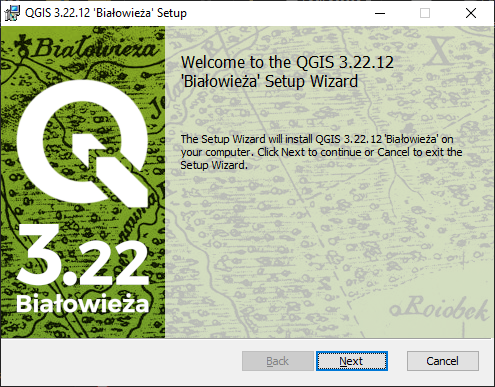
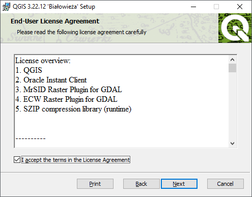

.. installation:

Software Installation
=====================

PostgreSQL
----------

  Go to https://www.postgresql.org/download/, download and install the PostgreSQL 9.5 release for your operating system.

  Run the installer file

  Click the *Next>* button to proceed with the installation.

  
  Select the directory where the program **PostgreSQL** will be installed and then click the *Next>* button
  

  
  Select the directory where the database data and the database files system setup will be installed and press the *Next>* button
  

  
--------------

.. Note:: - If possible, install the program files on the drive ``C:\`` and the database on the drive ``D:\``.
          - Use a **hard drive** of type ``SSD`` where the database will be stored.

--------------

  Set the user password ``postgres`` for **postgres** and click the *Next>* button
  

  
  Set the default port ``5432`` and click the *Next>* button

  Select *locale* with ``C`` and then click the *Next>* button

  
  Click the *Next>* Button to Begin PostgreSQL Installation

 
  Uncheck the option to run Stack Builder and click the *Finish* button to finish PostgreSQL installation.

--------------

.. note:: - If you want to install the latest version of PostGIS, check the option to run *stack builder* and proceed with installation by checking the option for spatial extent. In our case, we will install a specific version of PostGIS, so uncheck this option.

--------------

PostGIS
-------

  Go to http://postgis.net/install/, download and install the PostGIS 2.3 version for PostgreSQL 9.5 for your operating system.

  Run the installer file

  Click the *I Agree* button to proceed with the installation.

  Leave *PostGIS* checked and click the *Next>* button

   
  Enter the directory where PostgreSQL is installed and click the *Next>* button.

   
  Click the *Yes* button to proceed with the installation.

   
  Click the *Yes* button to proceed with the installation.

  
  Click the *Yes* button to proceed with the installation.

   
  Click the *Close* button to finish the installation.

   
QGIS
----

  Go to https://www.qgis.org/en/site/index.html, download and install version 3.4 for your operating system.

  Run the installer file

  Click the *Next* button to proceed with the installation.

  Click the *I Agree* button

   
  Enter the directory where QGIS will be installed and click the *Next>* button

   
  Leave only *QGIS* checked and Click *Install* button to begin installation

.. figure:: ./installation/install_qgis_04.png
   
  Click the *Finish* button to complete the installation.

.. figure:: ./installation/install_qgis_05.png
   
--------------

.. note:: - You can install more than one version of QGIS on your computer without having to remove the previous installation.

--------------
