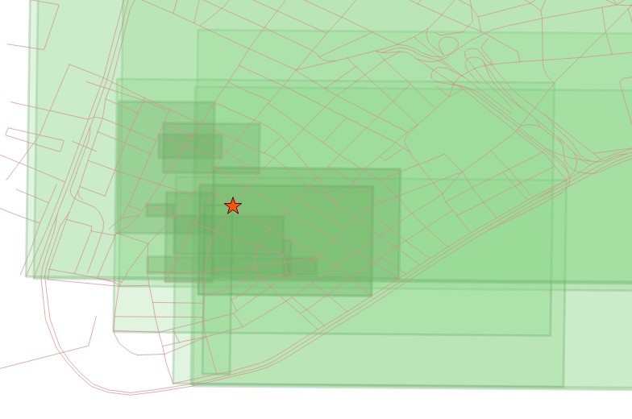

.. _knn:

Nearest-Neighbour Searching
===========================

Spatial Operators
-----------------

Spatial Operators_ can be of two types:

- Bounding Box Operators

- Distance Operators

Nearest-Neighbour Searching uses Distance Operators

What is a Nearest Neighbour Search?
-----------------------------------

A frequently posed spatial query is: "what is the nearest <candidate feature> to <query feature>?"

Unlike a distance search, the "nearest neighbour" search doesn't include any measurement restricting how far away candidate geometries might be, features of any distance away will be accepted, as long as they are the *nearest*. This poses a problem for traditional index-assisted queries, that require a search box, and therefore need some kind of measurement value to build the box.

The naive way to carry out a nearest neighbour query is to order the candidate table by distance from the query geometry, and then take the record with the smallest distance:

.. code-block:: sql
 
  SELECT streets.gid, streets.name 
  FROM nyc_streets streets, nyc_subway_stations subways
  WHERE subways.name = 'Broad St'
  ORDER BY ST_Distance(streets.geom, subways.geom) ASC
  LIMIT 1;
..

::

    gid  |  name
  -------+---------
   17385 | Wall St

..

 Closest street to Broad Street station is Wall St.

The trouble with this approach is that it forces the database to calculate the distance between the query geometry and *every* feature in the table of candidate features, then sort them all. For a large table of candidate features, it is not a reasonable approach.

One way to improve performance is to add an **index constraint** to the search. This requires a magic number: what's the smallest box we could search around the query geometry, and still come up with at least one candidate geometry? 

If you turn on timing, you can see the performance difference between the box-assisted query below and the simple query above.

.. code-block:: sql
  
  SELECT streets.gid, streets.name 
  FROM nyc_streets streets, nyc_subway_stations subways
  WHERE subways.name = 'Broad St'
  AND streets.geom && ST_Expand(subways.geom, 200) -- Magic number: 200m
  ORDER BY ST_Distance(streets.geom, subways.geom) ASC
  LIMIT 1;

..

::

    gid  |  name
  -------+---------
   17385 | Wall St

..

Again, the Closest street to Broad Street station is Wall St, but processing time is the half of the previous one.

The problem with this approach is the magic number of 200 meters. What if there had not happened to be any roads within 200m? We would have failed to come up with a result: there is always a nearest neighbour, it just might not be within 200m.

Index-based **KNN**
---------------

**KNN** stands for "K nearest neighbours", where "K" is the number of neighbours you are looking for.

**KNN** is a pure index based nearest neighbour search. By walking up and down the index, the search can find the nearest candidate geometries without using any magical search radius numbers, so the technique is suitable and high performance even for very large tables with highly variable data densities.

-----

.. note:: - The KNN feature is only available on PostGIS 2.0 with PostgreSQL 9.1 or greater.
          - Enhanced: 2.2.0: True KNN ("K nearest neighbor") behavior for geometry and geography for PostgreSQL 9.5+. Note for geography KNN is based on sphere rather than spheroid. For PostgreSQL 9.4 and below, geography support is new but only supports centroid box.
          - Changed: 2.2.0 -- For PostgreSQL 9.5 users, old Hybrid syntax may be slower, so you'll want to get rid of that hack if you are running your code only on PostGIS 2.2+ 9.5+.
          - Availability: 2.0.0: Weak KNN provides nearest neighbors based on geometry centroid distances instead of true distances. Exact results for points, inexact for all other types. Available for PostgreSQL 9.1+

-----

The **KNN** system works by evaluating distances between bounding boxes inside the PostGIS R-Tree index.

In prior versions, because the index was built using the bounding boxes of geometries, the distances between any geometries that weren't points could be inexact: they were the distances between the bounding boxes of geometries. In current versions (PostGIS 2.2+ PostgreSQL 9.5+) this operator returns the true 2D distance between two geometries.

The syntax of the index-based **KNN** query places a special "index-based distance operator" in the ORDER BY clause of the query, in this case "<->". There are two index-based distance operators, 

* **<->** means "distance between geometries"
* **<#>** means "distance between box edges"

Closest 10 streets to Broad Street station:

.. code-block:: sql
  
  SELECT streets.gid, streets.name
  FROM nyc_streets streets
  ORDER BY streets.geom <-> (SELECT geom FROM nyc_subway_stations WHERE name = 'Broad St')
  LIMIT 10;

..

::

    gid  |    name
  -------+-------------
   17385 | Wall St
   17390 | Broad St
   17436 | Nassau St
   17350 | New St
   17402 | Pine St
   17360 | Exchange Pl
   17315 | Broadway
   17289 | Rector St
   17469 | William St
   17347 | Cedar St
 
..

One side of the index-based distance operator must be a literal geometry value. We can get away with a subquery that returns as single geometry, or we could include a WKT_ geometry instead.

.. code-block:: sql

  SELECT ST_AsEWKT(geom)
  FROM nyc_subway_stations 
  WHERE name = 'Broad St';
  
..

::

                        st_asewkt
  -----------------------------------------------------
   SRID=26918;POINT(583571.905921312 4506714.34119218)
..

Same query using a geometry EWKT literal:

.. code-block:: sql

  SELECT
    streets.gid,
    streets.name,
    ST_Distance(streets.geom, 'SRID=26918;POINT(583571.905921312 4506714.34119218)'::geometry) AS distance
  FROM nyc_streets streets
  ORDER BY streets.geom <-> 'SRID=26918;POINT(583571.905921312 4506714.34119218)'::geometry
  LIMIT 10;

..

::

    gid  |    name     |     distance
  -------+-------------+-------------------
   17385 | Wall St     | 0.714202224374917
   17390 | Broad St    | 0.872022763400183
   17436 | Nassau St   |  1.29928727926582
   17350 | New St      |  63.9499165490674
   17402 | Pine St     |  75.8461038368021
   17360 | Exchange Pl |    101.6241843136
   17315 | Broadway    |  112.049824188021
   17289 | Rector St   |  114.442000781044
   17469 | William St  |  126.934064759446
   17347 | Cedar St    |  133.009278387597
 
..

What about the **<#>** operator? If we calculate the distance between box edges, the station would fall **inside** the Wall Street box, giving it a distance of zero and the first entry in the list, right?

.. code-block:: sql

  SELECT streets.gid, streets.name
  FROM nyc_streets streets
  ORDER BY streets.geom <#> 'SRID=26918;POINT(583571.905921312 4506714.34119218)'::geometry
  LIMIT 10;

Unfortunately, no.

::

   gid  |                               name
 -------+------------------------------------------------------------------
  17308 | Pearl St
  17357 | South St
  17385 | Wall St
  17230 |
  17235 | West Side Highway; West St; West Side Highway; West Side Highway
  17315 | Broadway
  17402 | Pine St
  19088 | FDR Dr
  19087 | FDR Dr
  17390 | Broad St

There are a number of large street features with big boxes that **also** overlap the station and yield a box distance of zero. 

..

Below you can see the distance calculated using the operators above:

.. code-block:: sql

 SELECT
 streets.gid,
 streets.name,
 ST_Distance(streets.geom, 'SRID=26918;POINT(583571.905921312 4506714.34119218)'::geometry) as geom_dist,
 streets.geom <-> 'SRID=26918;POINT(583571.905921312 4506714.34119218)'::geometry as geom_dist_knn,
 streets.geom <#> 'SRID=26918;POINT(583571.905921312 4506714.34119218)'::geometry as geom_dist_box
 FROM nyc_streets streets
 ORDER BY streets.geom <-> 'SRID=26918;POINT(583571.905921312 4506714.34119218)'::geometry
 LIMIT 10;

..

::

   gid  |    name     |     geom_dist     |   geom_dist_knn   |  geom_dist_box
 -------+-------------+-------------------+-------------------+------------------
  17385 | Wall St     | 0.714202224374917 | 0.714202224374917 |                0
  17390 | Broad St    | 0.872022763400183 | 0.872022763400183 |           0.3125
  17436 | Nassau St   |  1.29928727926582 |  1.29928727926582 |                1
  17350 | New St      |  63.9499165490674 |  63.9499165490674 |            49.75
  17402 | Pine St     |  75.8461038368021 |  75.8461038368021 |                0
  17360 | Exchange Pl |    101.6241843136 |    101.6241843136 |             36.5
  17315 | Broadway    |  112.049824188021 |  112.049824188021 |                0
  17289 | Rector St   |  114.442000781044 |  114.442000781044 | 114.280425379852
  17469 | William St  |  126.934064759446 |  126.934064759446 |          59.3125
  17347 | Cedar St    |  133.009278387597 |  133.009278387597 |              113
  
..

Bounding Box Operators
----------------------

Bounding Box Operators are based on the geometry's box limits.

Using these Bounding Box Operators you can tell if a geometry's bounding box is inside, left(west), right(east), above(north) or below(south) from a specific geometry.

In the example below we can list the 10 western (<<) streets closer to the 'Broad St' station.

.. code-block:: sql

 SELECT
 streets.gid,
 streets.name,
 ST_Distance(streets.geom, 'SRID=26918;POINT(583571.905921312 4506714.34119218)'::geometry) as geom_dist
 FROM nyc_streets streets
 WHERE streets.geom << 'SRID=26918;POINT(583571.905921312 4506714.34119218)'::geometry
 ORDER BY streets.geom <-> 'SRID=26918;POINT(583571.905921312 4506714.34119218)'::geometry
 LIMIT 10;

::

   gid  |     name     |     geom_dist
 -------+--------------+-------------------
  17390 | Broad St     | 0.872022763400183
  17350 | New St       |  63.9499165490674
  17289 | Rector St    |  114.442000781044
  17332 | Exchange Aly |  159.618545539243
  17345 | Thames St    |  167.802276238319
  17314 | Trinity Pl   |  205.942231743204
  17321 | Edgar St     |  241.145169159497
  17317 | Edgar Steet  |  252.178882764319
  17313 | Morris St    |  261.031862342452
  17333 | Broadway     |  261.031862342452

..

This result must be analysed very carefully because even being located west from the station, if the street's bounding box is also located east from the feature, this street won't be selected. These types of operators work fine for points, but is less precise for  linear or polygonal features.

In this example we can list the 10 western (<<) stations closer to the 'Broad St' station.

.. code-block:: sql

 SELECT
 stations.gid,
 stations.name,
 ST_Distance(stations.geom, 'SRID=26918;POINT(583571.905921312 4506714.34119218)'::geometry) as geom_dist
 FROM nyc_subway_stations stations
 WHERE stations.geom << 'SRID=26918;POINT(583571.905921312 4506714.34119218)'::geometry
 ORDER BY stations.geom <-> 'SRID=26918;POINT(583571.905921312 4506714.34119218)'::geometry
 LIMIT 10;

::

  gid |     name      |    geom_dist
 -----+---------------+------------------
  373 | Wall St       | 112.225703120796
  366 | Rector St     | 205.933935630939
    2 | Rector St     | 263.634450896677
    1 | Cortlandt St  |  366.95090566337
  331 | Bowling Green |  372.29593392249
  383 | Cortlandt St  | 441.227574880824
  375 | Whitehall St  | 539.332690223642
    3 | South Ferry   | 698.066900710806
   86 | 53rd St       | 6924.02111062638
   88 | 59th St       | 7317.53074590079

..

List of Operators
----------------------

&& — Returns TRUE if A's 2D bounding box intersects B's 2D bounding box.

&&(geometry,box2df) — Returns TRUE if a geometry's (cached) 2D bounding box intersects a 2D float precision bounding box (BOX2DF).

&&(box2df,geometry) — Returns TRUE if a 2D float precision bounding box (BOX2DF) intersects a geometry's (cached) 2D bounding box.

&&(box2df,box2df) — Returns TRUE if two 2D float precision bounding boxes (BOX2DF) intersect each other.

&&& — Returns TRUE if A's n-D bounding box intersects B's n-D bounding box.

&&&(geometry,gidx) — Returns TRUE if a geometry's (cached) n-D bounding box intersects a n-D float precision bounding box (GIDX).

&&&(gidx,geometry) — Returns TRUE if a n-D float precision bounding box (GIDX) intersects a geometry's (cached) n-D bounding box.

&&&(gidx,gidx) — Returns TRUE if two n-D float precision bounding boxes (GIDX) intersect each other.

&< — Returns TRUE if A's bounding box overlaps or is to the left of B's.

&<| — Returns TRUE if A's bounding box overlaps or is below B's.

&> — Returns TRUE if A' bounding box overlaps or is to the right of B's.

<< — Returns TRUE if A's bounding box is strictly to the left of B's.

<<| — Returns TRUE if A's bounding box is strictly below B's.

= — Returns TRUE if the coordinates and coordinate order geometry/geography A are the same as the coordinates and coordinate order of geometry/geography B.

>> — Returns TRUE if A's bounding box is strictly to the right of B's.

@ — Returns TRUE if A's bounding box is contained by B's.

@(geometry,box2df) — Returns TRUE if a geometry's 2D bounding box is contained into a 2D float precision bounding box (BOX2DF).

@(box2df,geometry) — Returns TRUE if a 2D float precision bounding box (BOX2DF) is contained into a geometry's 2D bounding box.

@(box2df,box2df) — Returns TRUE if a 2D float precision bounding box (BOX2DF) is contained into another 2D float precision bounding box.

|&> — Returns TRUE if A's bounding box overlaps or is above B's.

|>> — Returns TRUE if A's bounding box is strictly above B's.

~ — Returns TRUE if A's bounding box contains B's.

~(geometry,box2df) — Returns TRUE if a geometry's 2D bonding box contains a 2D float precision bounding box (GIDX).

~(box2df,geometry) — Returns TRUE if a 2D float precision bounding box (BOX2DF) contains a geometry's 2D bonding box.

~(box2df,box2df) — Returns TRUE if a 2D float precision bounding box (BOX2DF) contains another 2D float precision bounding box (BOX2DF).

~= — Returns TRUE if A's bounding box is the same as B's.

<-> — Returns the 2D distance between A and B.

|=| — Returns the distance between A and B trajectories at their closest point of approach.

<#> — Returns the 2D distance between A and B bounding boxes.

<<->> — Returns the n-D distance between the centroids of A and B bounding boxes.

<<#>> — Returns the n-D distance between A and B bounding boxes.

.. _WKT: https://en.wikipedia.org/wiki/Well-known_text_representation_of_geometry

.. _Operators: https://postgis.net/docs/reference.html#idm9872

