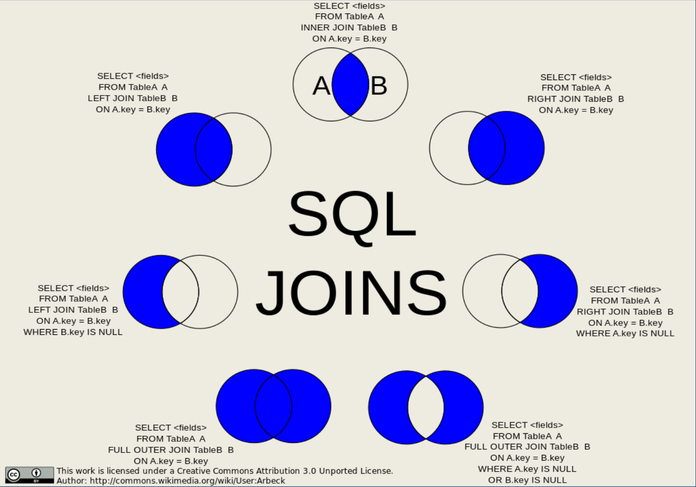

.. _non_spatial_join:

Non Spatial JOIN Using SQL
==========================

An `SQL <https://en.wikipedia.org/wiki/SQL>`__ **JOIN** clause - corresponding to a `join operation in relational algebra <https://en.wikipedia.org/wiki/Join_(relational_algebra)>`__ - combines `columns <https://en.wikipedia.org/wiki/Column_(database)>`__ from one or more `tables <https://en.wikipedia.org/wiki/Table_(database)>`__ in a relational `database <https://en.wikipedia.org/wiki/Database>`__.

It creates a set that can be saved as a table or used as it is.

A **JOIN** is a means for combining `columns <https://en.wikipedia.org/wiki/Column_(database)>`__ from one (self-join) or more tables by using values common to each.

As a special case, a table (base table, `view <https://en.wikipedia.org/wiki/View_(database)>`__, or joined table) can **JOIN** to itself in a *self-join*.

A programmer declares a **JOIN** statement to identify rows for joining. If the evaluated predicate is true, the combined row is then produced in the expected format, a row set or a temporary table.

To know more about this subject, `Click Here! <https://en.wikipedia.org/wiki/Join_(SQL)>`_

Types of JOIN:
--------------

`ANSI-standard SQL <https://en.wikipedia.org/wiki/American_National_Standards_Institute>`__ specifies five types of **JOIN**: ``INNER``, ``LEFT OUTER``, ``RIGHT OUTER``, ``FULL OUTER`` and ``CROSS``.

1. **Inner Join** - all rows in one table relate to all rows in other tables if they have at least 1 field in common.

   * ``Equi-join``  - An equi-join is a specific comparator-based join type, which uses only equality comparisons in the join predicate. Using other comparison operators (such as <) disqualifies an association as an equi-join.

   * ``Natural join`` - The natural join is a special case of equi-join. The natural join (⋈) is a binary operator that is written as (R ⋈ S) where R and S are relations. The result of the natural join is the set of all tuple combinations in R and S that are equal in their common attribute names.

2. **Outer Join** - is a selection that does not require records in one table to have equivalent records in other

   * ``Left Outer Join`` - all records in the left table even when there are no matching records in the right table.

   * ``Right Outer Join`` - all records in the right table even when there are no matching records in the left table.
   
   * ``Full Outer Join`` - This operation displays all data from the left and right tables, even if they are not matched in another table.

3. **Self-Join** - A self-join is joining a table to itself.

   
   *Simplified diagram with SQL join types between tables* 

Sample Tables
-------------

Relational databases are usually `normalized <https://en.wikipedia.org/wiki/Database_normalization>`__ to eliminate duplication of information such as when entity types have one-to-many relationships. For example, a department may be associated with a number of employees. Joining separate tables for department and employee effectively creates another table which combines the information from both tables.

All subsequent explanations on join types in this tutorial make use of the following two tables:

.. table:: *employee table*

   +------------+--------------+
   | lastname   | departmentid |
   +============+==============+
   | Rafferty   | 31           |
   +------------+--------------+
   | Jones      | 33           |
   +------------+--------------+
   | Heisenberg | 33           |
   +------------+--------------+
   | Robinson   | 34           |
   +------------+--------------+
   | Smith      | 34           |
   +------------+--------------+
   | Williams   | ``NULL``     |
   +------------+--------------+

.. table:: *department table*

   +--------------+----------------+
   | departmentid | departmentname |
   +==============+================+
   | 31           | Sales          |
   +--------------+----------------+
   | 33           | Engineering    |
   +--------------+----------------+
   | 34           | Clerical       |
   +--------------+----------------+
   | 35           | Marketing      |
   +--------------+----------------+

-----

.. Note:: - In the ``employee`` table above, the employee *Williams* has not been assigned to any department yet. Also, note that no employees are assigned to the *Marketing* department.

-----

The rows in these tables serve to illustrate the effect of different types of joins and join-predicates. In the following tables the ``departmentid`` `column <https://en.wikipedia.org/wiki/Column_(database)>`__ of the ``department`` table (which can be designated as ``department.departmentid``) is the `primary key <https://en.wikipedia.org/wiki/Primary_key>`__, while ``employee.departmentid`` is a `foreign key <https://en.wikipedia.org/wiki/Foreign_key>`__.

**Below is the SQL statement to PostgreSQL to create the aforementioned tables.**

  Create the department and employee tables and enter their data using the instructions below into the ``nyc`` database:  
  
.. code-block:: sql

  CREATE TABLE department
  (
  departmentid integer,
  departmentname varchar(20)
  );

  CREATE TABLE employee
  (
  lastname VARCHAR(20),
  departmentid integer
  );

  INSERT INTO department VALUES(31, 'Sales');
  INSERT INTO department VALUES(33, 'Engineering');
  INSERT INTO department VALUES(34, 'Clerical');
  INSERT INTO department VALUES(35, 'Marketing');

  INSERT INTO employee VALUES('Rafferty', 31);
  INSERT INTO employee VALUES('Jones', 33);
  INSERT INTO employee VALUES('Heisenberg', 33);
  INSERT INTO employee VALUES('Robinson', 34);
  INSERT INTO employee VALUES('Smith', 34);
  INSERT INTO employee VALUES('Williams', NULL);

Cross-Join
----------

CROSS JOIN returns the `Cartesian product <https://en.wikipedia.org/wiki/Cartesian_product>`__ of rows from tables in the join. In other words, it will produce rows which combine each row from the first table with each row from the second table.

**Example of an explicit cross join:**

.. code-block:: sql

    SELECT *
    FROM employee CROSS JOIN department;

**Example of an implicit cross join:**

.. code-block:: sql

    SELECT *
    FROM employee, department;

+-----------------+-----------------+-----------------+-----------------+
| lastname        | departmentid    | departmentname  | departmentid    |
+=================+=================+=================+=================+
| Rafferty        | 31              | Sales           | 31              |
+-----------------+-----------------+-----------------+-----------------+
| Jones           | 33              | Sales           | 31              |
+-----------------+-----------------+-----------------+-----------------+
| Heisenberg      | 33              | Sales           | 31              |
+-----------------+-----------------+-----------------+-----------------+
| Smith           | 34              | Sales           | 31              |
+-----------------+-----------------+-----------------+-----------------+
| Robinson        | 34              | Sales           | 31              |
+-----------------+-----------------+-----------------+-----------------+
| Williams        | ``NULL``        | Sales           | 31              |
+-----------------+-----------------+-----------------+-----------------+
| Rafferty        | 31              | Engineering     | 33              |
+-----------------+-----------------+-----------------+-----------------+
| Jones           | 33              | Engineering     | 33              |
+-----------------+-----------------+-----------------+-----------------+
| Heisenberg      | 33              | Engineering     | 33              |
+-----------------+-----------------+-----------------+-----------------+
| Smith           | 34              | Engineering     | 33              |
+-----------------+-----------------+-----------------+-----------------+
| Robinson        | 34              | Engineering     | 33              |
+-----------------+-----------------+-----------------+-----------------+
| Williams        | ``NULL``        | Engineering     | 33              |
+-----------------+-----------------+-----------------+-----------------+
| Rafferty        | 31              | Clerical        | 34              |
+-----------------+-----------------+-----------------+-----------------+
| Jones           | 33              | Clerical        | 34              |
+-----------------+-----------------+-----------------+-----------------+
| Heisenberg      | 33              | Clerical        | 34              |
+-----------------+-----------------+-----------------+-----------------+
| Smith           | 34              | Clerical        | 34              |
+-----------------+-----------------+-----------------+-----------------+
| Robinson        | 34              | Clerical        | 34              |
+-----------------+-----------------+-----------------+-----------------+
| Williams        | ``NULL``        | Clerical        | 34              |
+-----------------+-----------------+-----------------+-----------------+
| Rafferty        | 31              | Marketing       | 35              |
+-----------------+-----------------+-----------------+-----------------+
| Jones           | 33              | Marketing       | 35              |
+-----------------+-----------------+-----------------+-----------------+
| Heisenberg      | 33              | Marketing       | 35              |
+-----------------+-----------------+-----------------+-----------------+
| Smith           | 34              | Marketing       | 35              |
+-----------------+-----------------+-----------------+-----------------+
| Robinson        | 34              | Marketing       | 35              |
+-----------------+-----------------+-----------------+-----------------+
| Williams        | ``NULL``        | Marketing       | 35              |
+-----------------+-----------------+-----------------+-----------------+

::

    lastname  | departmentid | departmentid | departmentname
  ------------+--------------+--------------+----------------
   Rafferty   |           31 |           31 | Sales
   Rafferty   |           31 |           33 | Engineering
   Rafferty   |           31 |           34 | Clerical
   Rafferty   |           31 |           35 | Marketing
   Jones      |           33 |           31 | Sales
   Jones      |           33 |           33 | Engineering
   Jones      |           33 |           34 | Clerical
   Jones      |           33 |           35 | Marketing
   Heisenberg |           33 |           31 | Sales
   Heisenberg |           33 |           33 | Engineering
   Heisenberg |           33 |           34 | Clerical
   Heisenberg |           33 |           35 | Marketing
   Robinson   |           34 |           31 | Sales
   Robinson   |           34 |           33 | Engineering
   Robinson   |           34 |           34 | Clerical
   Robinson   |           34 |           35 | Marketing
   Smith      |           34 |           31 | Sales
   Smith      |           34 |           33 | Engineering
   Smith      |           34 |           34 | Clerical
   Smith      |           34 |           35 | Marketing
   Williams   |              |           31 | Sales
   Williams   |              |           33 | Engineering
   Williams   |              |           34 | Clerical
   Williams   |              |           35 | Marketing

The cross join does not itself apply any predicate to filter rows from the joined table. The results of a cross join can be filtered by using a `WHERE <https://en.wikipedia.org/wiki/Where_(SQL)>`__ clause which may then produce the equivalent of an inner join.

In the `SQL:2011 <https://en.wikipedia.org/wiki/SQL:2011>`__ standard, cross joins are part of the optional F401, "Extended joined table", package.

Normal uses are for checking the server's performance.

Inner Join
----------

An **inner join** requires each row in the two joined tables to have matching column values, and is a commonly used join operation in `applications <https://en.wikipedia.org/wiki/Application_software>`__ but should not be assumed to be the best choice in all situations.

**Inner join** creates a new result table by combining column values of two tables (A and B) based upon the join-predicate. The query compares each row of A with each row of B to find all pairs of rows that satisfy the join-predicate.

When the join-predicate is satisfied by matching non-\ `NULL <https://en.wikipedia.org/wiki/Null_(SQL)>`__ values, column values for each matched pair of rows of A and B are combined into a result row.

The result of the join can be defined as the outcome of first taking the `Cartesian product <https://en.wikipedia.org/wiki/Cartesian_product>`__ (or `Cross join <https://en.wikipedia.org/wiki/Join_(SQL)#Cross_join>`__) of all rows in the tables (combining every row in table A with every row in table B) and then returning all rows that satisfy the join predicate.

Actual SQL implementations normally use other approaches, such as `hash joins <https://en.wikipedia.org/wiki/Hash_join>`__ or `sort-merge joins <https://en.wikipedia.org/wiki/Sort-merge_join>`__, since computing the Cartesian product is slower and would often require a prohibitively large amount of memory to store.

SQL specifies two different syntactical ways to express joins: the "explicit join notation" and the "implicit join notation". The "implicit join notation" is no longer considered a best practice, although database systems still support it.

The "explicit join notation" uses the ``JOIN`` keyword, optionally preceded by the ``INNER`` keyword, to specify the table to join, and the ``ON`` keyword to specify the predicates for the join, as in the following example:

.. code-block:: sql

    SELECT employee.lastname, employee.departmentid, department.departmentname 
    FROM employee INNER JOIN department ON employee.departmentid = department.departmentid;

+-------------------+-----------------------+---------------------------+
| lastname          | departmentid          | departmentname            |
+===================+=======================+===========================+
| Robinson          | 34                    | Clerical                  |
+-------------------+-----------------------+---------------------------+
| Jones             | 33                    | Engineering               |
+-------------------+-----------------------+---------------------------+
| Smith             | 34                    | Clerical                  |
+-------------------+-----------------------+---------------------------+
| Heisenberg        | 33                    | Engineering               |
+-------------------+-----------------------+---------------------------+
| Rafferty          | 31                    | Sales                     |
+-------------------+-----------------------+---------------------------+

The **implicit join notation** simply lists the tables for joining, in the ``FROM`` clause of the ``SELECT`` statement, using commas to separate them. Thus it specifies a `cross join <https://en.wikipedia.org/wiki/Join_(SQL)#Cross_join>`__, and the ``WHERE`` clause may apply additional filter-predicates (which function comparably to the join-predicates in the explicit notation).

The following example is equivalent to the previous one, but this time using implicit join notation:

.. code-block:: sql

    SELECT *
    FROM employee, department
    WHERE employee.departmentid = department.departmentid;

The queries given in the examples above will join the ``employee`` and ``department`` tables using the ``departmentid`` column of both tables. Where the ``departmentid`` of these tables match (i.e. the join-predicate is satisfied), the query will combine the ``lastname``, ``departmentid`` and ``departmentname`` columns from the two tables into a result row. Where the departmentid does not match, no result row is generated.

Thus the result of the `execution <https://en.wikipedia.org/wiki/Query_plan>`__ of the query above will be:

+-----------------+-----------------+-----------------+-----------------+
| lastname        | departmentid    | departmentname  | departmentid    |
+=================+=================+=================+=================+
| Robinson        | 34              | Clerical        | 34              |
+-----------------+-----------------+-----------------+-----------------+
| Jones           | 33              | Engineering     | 33              |
+-----------------+-----------------+-----------------+-----------------+
| Smith           | 34              | Clerical        | 34              |
+-----------------+-----------------+-----------------+-----------------+
| Heisenberg      | 33              | Engineering     | 33              |
+-----------------+-----------------+-----------------+-----------------+
| Rafferty        | 31              | Sales           | 31              |
+-----------------+-----------------+-----------------+-----------------+

The employee *Williams* and the department *Marketing* do not appear in the query execution results. Neither of these has any matching rows in the other respective table: *Williams* has no associated department, and no employee has the department id 35 (*Marketing*). Depending on the desired results, this behavior may be a subtle bug, which can be avoided by replacing the inner join with an `outer
join <https://en.wikipedia.org/wiki/Join_(SQL)#Outer_join>`__.

Programmers should take special care when joining tables on columns that can contain `NULL <https://en.wikipedia.org/wiki/Null_(SQL)>`__ values, since NULL will never match any other value (not even NULL itself), unless the join condition explicitly uses a combination predicate that first checks that the joins columns are ``NOT NULL`` before applying the remaining predicate condition(s).

The **inner join** can only be safely used in a database that enforces `referential integrity <https://en.wikipedia.org/wiki/Referential_integrity>`__ or where the join columns are guaranteed not to be NULL. Many `transaction processing <https://en.wikipedia.org/wiki/Transaction_processing>`__ relational databases rely on `Atomicity, Consistency, Isolation, Durability (ACID) <https://en.wikipedia.org/wiki/ACID>`__ data update standards to ensure data integrity, making inner joins an appropriate choice.

However transaction databases usually also have desirable join columns that are allowed to be NULL. Many reporting relational database and `data warehouses <https://en.wikipedia.org/wiki/Data_warehouse>`__ use high volume `Extract, Transform, Load (ETL) <https://en.wikipedia.org/wiki/Extract,_transform,_load>`__ batch updates which make referential integrity difficult or impossible to enforce, resulting in potentially NULL join columns that an SQL query author cannot modify and which cause **inner joins** to omit data with no indication of an error. The choice to use an *8inner join** depends on the database design and data characteristics. A **left outer join** can usually be substituted for an **inner join** when the join columns in one table may contain NULL values.

Any data column that may be NULL (empty) should never be used as a link in an **inner join**, unless the intended result is to eliminate the rows with the NULL value. If NULL join columns are to be deliberately removed from the result set, an **inner join** can be faster than an **outer join** because the table join and filtering is done in a single step.

Conversely, an **inner join** can result in disastrously slow performance or even a server crash when used in a large volume query in combination with database functions in an SQL Where clause.

A function in an SQL Where clause can result in the database ignoring relatively compact table indexes. The database may read and inner join the selected columns from both tables before reducing the number of rows using the filter that depends on a calculated value, resulting in a relatively enormous amount of inefficient processing.

When a result set is produced by joining several tables, including master tables used to look up full text descriptions of numeric
identifier codes (a `Lookup table <https://en.wikipedia.org/wiki/Lookup_table>`__), a NULL value in any one of the foreign keys can result in the entire row being eliminated from the result set, with no indication of error. A complex SQL query that includes one or more **inner joins** and several **outer joins** has the same risk for NULL values in the **inner join** link columns.

A commitment to SQL code containing **inner joins** assumes NULL join columns will not be introduced by future changes, including vendor updates, design changes and bulk processing outside of the application's data validation rules such as data conversions, migrations, bulk imports and merges.

-----

.. Note:: - One can further classify **inner joins** as **equi-joins**, as **natural joins**, or as **cross-joins**.

-----

Equi-Join
~~~~~~~~~~

An **equi-join** is a specific type of comparator-based join, that uses only `equality <https://en.wikipedia.org/wiki/Equality_(mathematics)>`__ comparisons in the join-predicate. Using other comparison operators (such as ``<``) disqualifies a join as an **equi-join**. The query shown above has already provided an example of an **equi-join**:

.. code-block:: sql

    SELECT *
    FROM employee JOIN department ON employee.departmentid = department.departmentid;

We can write **equi-join** as below,

.. code-block:: sql

    SELECT *
    FROM employee, department
    WHERE employee.departmentid = department.departmentid;

If columns in an equi-join have the same name, `SQL-92 <https://en.wikipedia.org/wiki/SQL-92>`__ provides an optional
shorthand notation for expressing equi-joins, by way of the ``USING`` construct.

.. code-block:: sql

    SELECT *
    FROM employee INNER JOIN department USING (departmentid);

The ``USING`` construct is more than mere `syntactic sugar <https://en.wikipedia.org/wiki/Syntactic_sugar>`__, however, since the result set differs from the result set of the version with the explicit predicate.

Specifically, any columns mentioned in the ``USING`` list will appear only once, with an unqualified name, rather than once for each table in the join. In the case above, there will be a single ``departmentid`` column and no ``employee.departmentid`` or ``department.departmentid``.

-----

.. Note:: - The ``USING`` clause is not supported by MS SQL Server and Sybase.

-----

Natural Join
~~~~~~~~~~~~

The **natural join** is a special case of **equi-join**. **Natural join** (⋈) is a `binary operator <https://en.wikipedia.org/wiki/Binary_relation>`__ that is written as (*R* ⋈ *S*) where *R* and *S* are `relations <https://en.wikipedia.org/wiki/Relation_(database)>`__.

The result of the **natural join** is the set of all combinations of `tuples <https://en.wikipedia.org/wiki/Tuples>`__ in *R* and *S* that are equal on their common attribute names. For an example consider the tables *Employee* and *Dept* and their natural join:

This can also be used to define `composition of relations <https://en.wikipedia.org/wiki/Composition_of_relations>`__.
For example, the composition of *employee* and *dept* is their join as shown above, projected on all but the common attribute *DeptName*. In `category theory <https://en.wikipedia.org/wiki/Category_theory>`__, the join is precisely the `fiber product <https://en.wikipedia.org/wiki/Fiber_product>`__.

The natural join is arguably one of the most important operators since it is the relational counterpart of logical AND. Note that if the same variable appears in each of two predicates that are connected by AND, then that variable stands for the same thing and both appearances must always be substituted by the same value.

In particular, the natural join allows the combination of relations that are associated by a `foreign key <https://en.wikipedia.org/wiki/Foreign_key>`__. For example, in the above example a foreign key probably holds from *Employee*.\ *DeptName* to *Dept*.\ *DeptName* and then the natural join of *Employee* and *Dept* combines all employees with their departments. This works because the foreign key holds between attributes with the same name. If this is not the case such as in the foreign key from *Dept*.\ *manager* to *Employee*.\ *Name* then these columns have to be renamed before the natural join is taken. Such a join is sometimes also referred to as an **equi-join**.

-----

.. Tip:: - Most experts agree that **NATURAL JOINs** are dangerous and therefore strongly discourage their use. The danger comes from inadvertently adding a new column, named the same as another column in the other table. An existing natural join might then "naturally" use the new column for comparisons, making comparisons/matches using different criteria (from different columns) than before.

------

Thus an existing query could produce different results, even though the data in the tables have not been changed, but only augmented. The use of column names to automatically determine table links is not an option in large databases with hundreds or thousands of tables where it would place an unrealistic constraint on naming conventions.

Real world databases are commonly designed with `foreign key <https://en.wikipedia.org/wiki/Foreign_key>`__ data that is not consistently populated (NULL values are allowed), due to business rules and context. It is common practice to modify column names of similar data in different tables and this lack of rigid consistency relegates **natural joins** to a theoretical concept for discussion.

The above sample query for **inner joins** can be expressed as a **natural join** in the following way:

.. code-block:: sql

    SELECT *
    FROM employee NATURAL JOIN department;

As with the explicit ``USING`` clause, only one ``departmentid`` column occurs in the joined table, with no qualifier:

+--------------+-------------------+---------------------------+
| DepartmentID | Employee.LastName | Department.DepartmentName |
+==============+===================+===========================+
| 34           | Smith             | Clerical                  |
+--------------+-------------------+---------------------------+
| 33           | Jones             | Engineering               |
+--------------+-------------------+---------------------------+
| 34           | Robinson          | Clerical                  |
+--------------+-------------------+---------------------------+
| 33           | Heisenberg        | Engineering               |
+--------------+-------------------+---------------------------+
| 31           | Rafferty          | Sales                     |
+--------------+-------------------+---------------------------+

PostgreSQL, MySQL and Oracle support natural joins; Microsoft T-SQL and IBM DB2 do not. The columns used in the join are implicit so the join code does not show which columns are expected, and a change in column names may change the results. In the `SQL:2011 <https://en.wikipedia.org/wiki/SQL:2011>`__ standard, **natural joins** are part of the optional F401, "Extended joined table", package.

In many database environments the column names are controlled by an outside vendor, not the query developer. A natural join assumes stability and consistency in column names which can change during vendor mandated version upgrades.

Outer Join
----------

The joined table retains each row—even if no other matching row exists. Outer joins subdivide further into **left outer joins**, **right outer joins**, and **full outer joins**, depending on which table's rows are retained: left, right, or both (in this case *left* and *right* refer to the two sides of the ``JOIN`` keyword).

No implicit join-notation for outer joins exists in standard SQL.

Left Outer Join
~~~~~~~~~~~~~~~~

The result of a **left outer join** (or simply **left join**) for tables A and B always contains all rows of the "left" table (A), even if the join-condition does not find any matching row in the "right" table (B). This means that if the ``ON`` clause matches 0 (zero) rows in B (for a given row in A), the join will still return a row in the result (for that row)—but with NULL in each column from B. A **left outer join** returns all the values from an inner join plus all values in the left table that do not match to the right table, including rows with NULL (empty) values in the link column.

For example, this allows us to find an employee's department, but still shows employees that have not been assigned to a department (contrary to the inner-join example above, where unassigned employees were excluded from the result).

Example of a **left outer join** (the **``OUTER``** keyword is optional), with the additional result row (compared with the inner join)
italicized:

.. code-block:: sql

    SELECT *
    FROM employee LEFT OUTER JOIN department ON employee.DepartmentID = department.DepartmentID;

+-----------------+-----------------+-----------------+-----------------+
| Employee.LastNa | Employee.Depart | Department.Depa | Department.Depa |
| me              | mentID          | rtmentName      | rtmentID        |
+=================+=================+=================+=================+
| Jones           | 33              | Engineering     | 33              |
+-----------------+-----------------+-----------------+-----------------+
| Rafferty        | 31              | Sales           | 31              |
+-----------------+-----------------+-----------------+-----------------+
| Robinson        | 34              | Clerical        | 34              |
+-----------------+-----------------+-----------------+-----------------+
| Smith           | 34              | Clerical        | 34              |
+-----------------+-----------------+-----------------+-----------------+
| *Williams*      | ``NULL``        | ``NULL``        | ``NULL``        |
+-----------------+-----------------+-----------------+-----------------+
| Heisenberg      | 33              | Engineering     | 33              |
+-----------------+-----------------+-----------------+-----------------+

Right Outer Join
~~~~~~~~~~~~~~~~

A **right outer join** (or **right join**) closely resembles a left outer join, except with the treatment of the tables reversed. Every row from the "right" table (B) will appear in the joined table at least once. If no matching row from the "left" table (A) exists, NULL will appear in columns from A for those rows that have no match in B.

A right outer join returns all the values from the right table and matched values from the left table (NULL in the case of no matching join predicate). For example, this allows us to find each employee and his or her department, but still show departments that have no employees.

Below is an example of a right outer join (the **``OUTER``** keyword is optional), with the additional result row italicized:

.. code-block:: sql

    SELECT *
    FROM employee RIGHT OUTER JOIN department ON employee.departmentid = department.departmentid;

+-----------------+-----------------+-----------------+-----------------+
| lastname        | departmentid    | departmentname  | departmentid    |
+=================+=================+=================+=================+
| Smith           | 34              | Clerical        | 34              |
+-----------------+-----------------+-----------------+-----------------+
| Jones           | 33              | Engineering     | 33              |
+-----------------+-----------------+-----------------+-----------------+
| Robinson        | 34              | Clerical        | 34              |
+-----------------+-----------------+-----------------+-----------------+
| Heisenberg      | 33              | Engineering     | 33              |
+-----------------+-----------------+-----------------+-----------------+
| Rafferty        | 31              | Sales           | 31              |
+-----------------+-----------------+-----------------+-----------------+
| ``NULL``        | ``NULL``        | *Marketing*     | *35*            |
+-----------------+-----------------+-----------------+-----------------+

Right and left outer joins are functionally equivalent. Neither provides any functionality that the other does not, so right and left outer joins may replace each other as long as the table order is switched.

Full Outer Join
~~~~~~~~~~~~~~~~

Conceptually, a **full outer join** combines the effect of applying both left and right outer joins. Where rows in the **FULL OUTER JOIN **(ed) tables do not match, the result set will have NULL values for every column of the table that lacks a matching row. For those rows that do match, a single row will be produced in the result set (containing columns populated from both tables).

For example, this allows us to see each employee who is in a department and each department that has an employee, but also see each employee who is not part of a department and each department which doesn't have an employee.

Example of a full outer join (the **``OUTER``** keyword is optional):

.. code-block:: sql

    SELECT *
    FROM employee FULL OUTER JOIN department ON employee.departmentid = department.departmentid;

+-----------------+-----------------+-----------------+-----------------+
| lastname        | departmentid    | departmentname  | departmentid    |
+=================+=================+=================+=================+
| Smith           | 34              | Clerical        | 34              |
+-----------------+-----------------+-----------------+-----------------+
| Jones           | 33              | Engineering     | 33              |
+-----------------+-----------------+-----------------+-----------------+
| Robinson        | 34              | Clerical        | 34              |
+-----------------+-----------------+-----------------+-----------------+
| *Williams*      | ``NULL``        | ``NULL``        | ``NULL``        |
+-----------------+-----------------+-----------------+-----------------+
| Heisenberg      | 33              | Engineering     | 33              |
+-----------------+-----------------+-----------------+-----------------+
| Rafferty        | 31              | Sales           | 31              |
+-----------------+-----------------+-----------------+-----------------+
| ``NULL``        | ``NULL``        | *Marketing*     | *35*            |
+-----------------+-----------------+-----------------+-----------------+

Self-Join
~~~~~~~~~~~~~~~~

A **self-join** is joining a table to itself.

  Enter two new columns in the ``employee`` table. One of type varchar(13) with ``country`` field name and one with ``employeeid`` column name of integer type:

.. code-block:: sql

    ALTER TABLE employee
    ADD COLUMN country varchar(13),
    ADD COLUMN employeeid integer;
    
..
    
  Delete all data from ``employee`` table
  
.. code-block:: sql

    DELETE FROM employee;

..

  Insert the data bellow in the table ``employee``:
  
.. code-block:: sql

    INSERT INTO employee (country, employeeid, lastname, departmentid) VALUES
    ('Australia', 123, 'Rafferty', 31),
    ('Australia', 124, 'Jones', 33),
    ('Australia', 145, 'Heisenberg', 33),
    ('United States', 201, 'Robinson', 34),
    ('Germany', 305, 'Smith', 34),
    ('Germany', 306, 'Williams', NULL);

If there were two separate tables for employees and a query which requested employees in the first table having the same country as employees in the second table, a normal join operation could be used to find the answer table. However, all the employee information is
contained within a single large table.

Considering the new modified ``Employee`` table such as the following:

.. table:: *new employee table*

   +------------+------------+---------------+--------------+
   | EmployeeID | LastName   | Country       | DepartmentID |
   +============+============+===============+==============+
   | 123        | Rafferty   | Australia     | 31           |
   +------------+------------+---------------+--------------+
   | 124        | Jones      | Australia     | 33           |
   +------------+------------+---------------+--------------+
   | 145        | Heisenberg | Australia     | 33           |
   +------------+------------+---------------+--------------+
   | 201        | Robinson   | United States | 34           |
   +------------+------------+---------------+--------------+
   | 305        | Smith      | Germany       | 34           |
   +------------+------------+---------------+--------------+
   | 306        | Williams   | Germany       | ``NULL``     |
   +------------+------------+---------------+--------------+

An example solution query could be as follows:

.. code-block:: sql

    SELECT f.employeeid, f.lastname, s.employeeid, s.lastname, f.country
    FROM employee f INNER JOIN employee s ON f.country = s.country
    WHERE f.employeeid < s.employeeid
    ORDER BY f.employeeid, s.employeeid;

Which results in the following table being generated.

.. table:: Employee Table after Self-join by Country

   +------------+----------+------------+------------+-----------+
   | employeeid | lastname | employeeid | lastname   | country   |
   +============+==========+============+============+===========+
   | 123        | Rafferty | 124        | Jones      | Australia |
   +------------+----------+------------+------------+-----------+
   | 123        | Rafferty | 145        | Heisenberg | Australia |
   +------------+----------+------------+------------+-----------+
   | 124        | Jones    | 145        | Heisenberg | Australia |
   +------------+----------+------------+------------+-----------+
   | 305        | Smith    | 306        | Williams   | Germany   |
   +------------+----------+------------+------------+-----------+

**For this example:**

-  ``f`` and ``s`` are `aliases <https://en.wikipedia.org/wiki/Alias_(SQL)>`__ for the first    and second copies of the employee table.
-  The condition ``f.country = s.country`` excludes pairings between employees in different countries. The example question only wanted pairs of employees in the same country.
-  The condition ``f.employeeID < s.employeeID`` excludes pairings where the ``employeeid`` of the first employee is greater than or equal to the ``EmployeeID`` of the second employee. In other words, the effect of this condition is to exclude duplicate pairings and self-pairings.

Without it, the following less useful table would be generated (the table below displays only the "Germany" portion of the result):

+------------+----------+------------+----------+---------+
| employeeid | lastname | employeeid | lastname | country |
+============+==========+============+==========+=========+
| 305        | Smith    | 305        | Smith    | Germany |
+------------+----------+------------+----------+---------+
| 305        | Smith    | 306        | Williams | Germany |
+------------+----------+------------+----------+---------+
| 306        | Williams | 305        | Smith    | Germany |
+------------+----------+------------+----------+---------+
| 306        | Williams | 306        | Williams | Germany |
+------------+----------+------------+----------+---------+

Only one of the two middle pairings is needed to satisfy the original question, and the topmost and bottommost are of no interest at all in this example.
