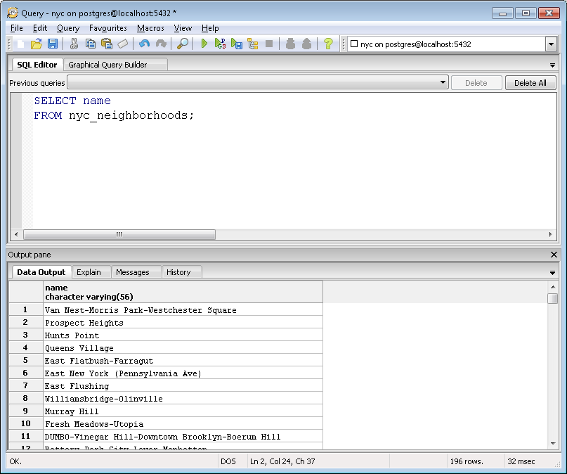

.. _simple_sql:

Simple SQL 
==============

SQL, or "Structured Query Language", is a means of asking questions and update data in relational databases.

If you want to know a little more about this subject `Click On here! <https://en.wikipedia.org/wiki/SQL>`_

SQL subsets
-----------

The SQL language is divided into subsets according to operations that we want to perform on a database, such as:

Data Manipulation Language (DML) 
~~~~~~~~~~~~~~~~~~~~~~~~~~~~~~~

The first group is Data Manipulation Language(DML). DML is a subset of the SQL language that is used to perform data inclusions, changes, and deletions present in records. These tasks can be performed on multiple records from multiple tables at same time.

Commands that perform the above functions respectively referred to are:

- Data Inclusions (INSERT);
- Data updates (UPDATE);
- Data Exclusions (DELETE)

Data Definition Language (DDL)
~~~~~~~~~~~~~~~~~~~~~~~~~~~~~~

The second group is Data Definition Language(DDL). A DDL allows the user to define new tables and elements associated.

The main commands used are:

- Object Creation (CREATE);
- Object Alteration (ALTER);
- Object Addition (ADD);
- Object Exclusion (DROP);
- Object Rename (RENAME);
- TRUNCATE

Object Types: Database, Table, Column, Constraint, User, Sequence, Function, View, Trigger, Index, etc.

Data Control Language (DCL)
~~~~~~~~~~~~~~~~~~~~~~~~~~~~~~~~~~~

The third group is the Data Control Language(DCL). DCL controls aspects of data authorization and user licenses to control who has access to view or manipulate data within the database. 

The main commands used are:

- User Authorization (GRANT);
- User Revocation (REVOKE).

Data Transaction Language (DTL)
~~~~~~~~~~~~~~~~~~~~~~~~~~~~~~

- BEGIN WORK (or START TRANSACTION, depending on SQL dialect) can be used to mark the beginning of a database transaction that can be completed or not.
- COMMIT ends a transaction within a management system Database
- ROLLBACK makes changes to existing data since last COMMIT or ROLLBACK are discarded.

Data Query Language (DQL)
~~~~~~~~~~~~~~~~~~~~~~~~~~~~~~~~~

Although it has only one command, DQL is the most commonly used part of SQL. The SELECT command allows the user to specify a query as a description of the desired outcome. This command is composed of various clauses and options, making it possible to elaborate simple to the most elaborate.

We will work almost exclusively with SELECT to ask questions from tables using spatial functions.

A selection query is usually of the form:

.. code-block:: sql

   SELECT some_columns FROM some_data_source WHERE some_condition;     

- ``some_columns`` are column names or value functions of column.

- ``some_data_source`` is a single table or a composite table created by joining two tables in a key or condition.

- ``some_condition`` is a filter that restricts the number of rows to be returned.

--------------

.. Note:: - For a synopsis of all SELECT parameters, see the documentation of `PostgreSQL <http://www.postgresql.org/docs/current/interactive/sql-select.html>`__.

--------------

The SQL language can be divided into:

- Clauses;
- Logical Operators;
- Relational Operators;
- Aggregation Functions;

Clauses
^^^^^^^^

- ``FROM`` - Used to specify the table to select the records.
- ``WHERE`` - Used to specify the conditions that must meet the records that will be selected.
- ``GROUP BY`` - Used to separate the selected records into specific groups.
- ``HAVING`` - Used to express the condition that must satisfy each group.
- ``ORDER BY`` - Used to sort the selected records with a specific order.
- ``DISTINCT`` - Used to select data without repeating.
- ``UNION`` - combine the results of two SQL queries into one table for all matching rows.

Logical Operators
^^^^^^^^^^^^^^^^^

- ``AND`` - And logical. Evaluates conditions and returns true value if both are correct.
- ``OR`` - OR logical. Evaluates conditions and returns true value if any is correct.
- ``NOT`` - Logical negation. Returns the opposite value of the expression.

Relational Operators
^^^^^^^^^^^^^^^^^^^^

- ``<`` Minor
- ``>`` Larger
- ``<=`` Less than or equal
- ``>=`` Greater than or equal
- ``=`` Equal
- ``<>`` Different
- ``BETWEEN`` - Value range
- ``LIKE`` - Data Comparison
- ``IN`` - If dataset is in a list
- ``IS`` or ``IS NOT`` - data comparison with null data;
- ``AS`` - Alias(nickname)

Aggregate Functions
^^^^^^^^^^^^^^^^^^^^

- ``AVG`` - Used to average values of a field determined.
- ``COUNT`` - Used to return the number of records in the selection.
- ``SUM`` - Used to return the sum of all values of a given field.
- ``MAX`` - Used to return the highest value of a field.
- ``MIN`` - Used to return the lowest value of a field.

Example
=======

You have already seen SQL when we created our first database.

Recall:

.. code-block:: sql

   SELECT postgis_full_version();

But that was a question about the database.

Now that we've loaded data into our database, let's use SQL to ask questions of the data! For example,

  "What are the names of all the neighborhoods in New York City?"
  
Open up the SQL query window in pgAdmin by clicking the SQL button

then enter the following query in to the query window

.. code-block:: sql

  SELECT name FROM nyc_neighborhoods;
  
and click the **Execute Query** button (the green triangle).
  
.. image:: ./screenshots/pgadmin_08.png  

The query will run for a few (milli)seconds and return the 129 results.

But what exactly happened here?  To understand, let's begin with the four "verbs" of SQL, 

* ``SELECT``, returns rows in response to a query
* ``INSERT``, adds new rows to a table
* ``UPDATE``, alters existing rows in a table
* ``DELETE``, removes rows from a table
 
We will be working almost exclusively with ``SELECT`` in order to ask questions of tables using spatial functions.

SELECT queries
--------------

A select query is generally of the form::

.. code-block:: sql

  SELECT some_columns
  FROM some_data_source
  WHERE some_condition;
  
.. note::

    For a synopsis of all ``SELECT`` parameters, see the `PostgresSQL documentation  <http://www.postgresql.org/docs/current/interactive/sql-select.html>`_.
    
The ``some_columns`` are either column names or functions of column values. The ``some_data_source`` is either a single table, or a composite table created by joining two tables on a key or condition. The ``some_condition`` is a filter that restricts the number of rows to be returned.

  "What are the names of all the neighborhoods in Brooklyn?"

We return to our ``nyc_neighborhoods`` table with a filter in hand.  The table contains all the neighborhoods in New York, but we only want the ones in Brooklyn.

.. code-block:: sql

  SELECT name 
  FROM nyc_neighborhoods 
  WHERE boroname = 'Brooklyn';

The query will run for even fewer (milli)seconds and return the 23 results.

Sometimes we will need to apply a function to the results of our query. For example,

  "What is the number of letters in the names of all the neighborhoods in Brooklyn?"
  
Fortunately, PostgreSQL has a string length function, :command:`char_length(string)`.

.. code-block:: sql

  SELECT char_length(name) 
  FROM nyc_neighborhoods 
  WHERE boroname = 'Brooklyn';

Often, we are less interested in the individual rows than in a statistic that applies to all of them. So knowing the lengths of the neighborhood names might be less interesting than knowing the average length of the names. Functions that take in multiple rows and return a single result are called "aggregate" functions.  

PostgreSQL has a series of built-in aggregate functions, including the general purpose :command:`avg()` for average values and :command:`stddev()` for standard deviations.

  "What is the average number of letters and standard deviation of number of letters in the names of all the neighborhoods in Brooklyn?"
  
.. code-block:: sql

  SELECT avg(char_length(name)), stddev(char_length(name)) 
  FROM nyc_neighborhoods 
  WHERE boroname = 'Brooklyn';
  
::

           avg         |       stddev       
  ---------------------+--------------------
   11.7391304347826087 | 3.9105613559407395

The aggregate functions in our last example were applied to every row in the result set. What if we want the summaries to be carried out over smaller groups within the overall result set? For that we add a ``GROUP BY`` clause. Aggregate functions often need an added ``GROUP BY`` statement to group the result-set by one or more columns.  

  "What is the average number of letters in the names of all the neighborhoods in New York City, reported by borough?"

.. code-block:: sql

  SELECT boroname, avg(char_length(name)), stddev(char_length(name)) 
  FROM nyc_neighborhoods 
  GROUP BY boroname;
 
We include the ``boroname`` column in the output result so we can determine which statistic applies to which borough. In an aggregate query, you can only output columns that are either (a) members of the grouping clause or (b) aggregate functions.
  
::

     boroname    |         avg         |       stddev       
  ---------------+---------------------+--------------------
   Brooklyn      | 11.7391304347826087 | 3.9105613559407395
   Manhattan     | 11.8214285714285714 | 4.3123729948325257
   The Bronx     | 12.0416666666666667 | 3.6651017740975152
   Queens        | 11.6666666666666667 | 5.0057438272815975
   Staten Island | 12.2916666666666667 | 5.2043390480959474
  
Function List
-------------

`avg(expression) <http://www.postgresql.org/docs/current/static/functions-aggregate.html#FUNCTIONS-AGGREGATE-TABLE>`_: PostgreSQL aggregate function that returns the average value of a numeric column.

`char_length(string) <http://www.postgresql.org/docs/current/static/functions-string.html>`_: PostgreSQL string function that returns the number of character in a string.

`stddev(expression) <http://www.postgresql.org/docs/current/static/functions-aggregate.html#FUNCTIONS-AGGREGATE-STATISTICS-TABLE>`_: PostgreSQL aggregate function that returns the standard deviation of input values.
  
  
