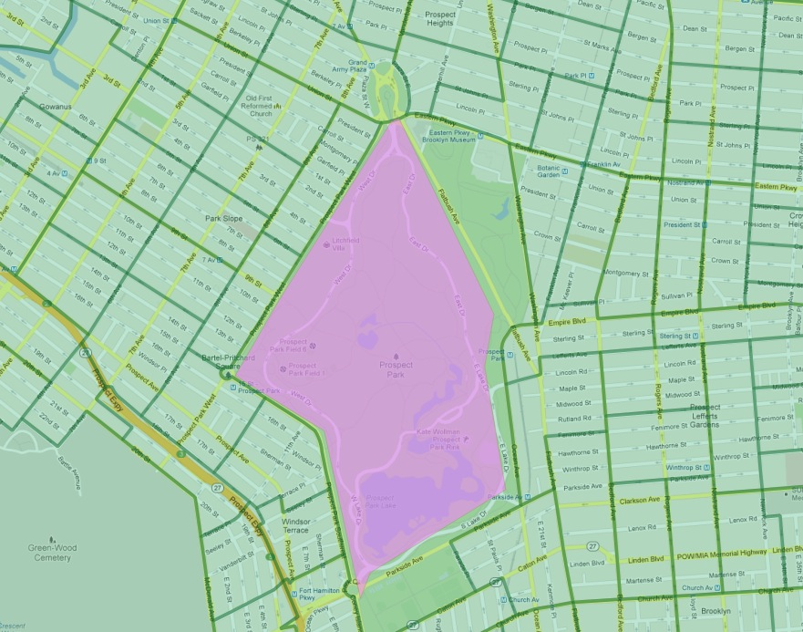
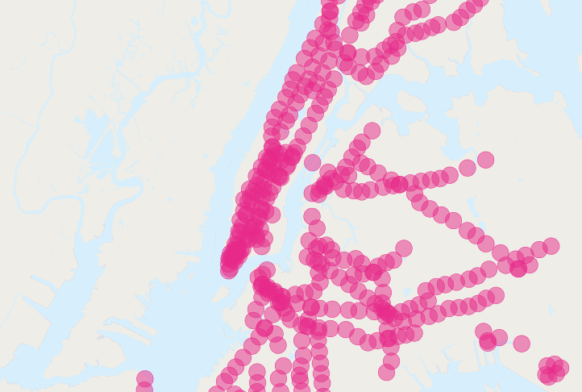

.. _spatial_joins_advanced:

More Spatial Joins
==================

In the last section we saw the ST_Centroid_ (geometry) and ST_Union_ ([geometry])` functions, and some simple examples. In this section we will do some more elaborate things with them.

.. _creatingtractstable:

Creating a Census Tracts Table
------------------------------

In the workshop `data <https://drive.google.com/drive/folders/1dmcVfJer0JJgXhj4ADcsEVUtP9nEHH_Z?usp=sharing>`_ directory, is a file that includes attribute data, but no geometry, ``nyc_census_sociodata.sql``. The table includes interesting socioeconomic data about New York: commute times, incomes, and education attainment. There is just one problem. The data are summarized by "census tract" and we have no census tract spatial data! 

In this section we will
~~~~~~~~~~~~~~~~~~~~~~~~

#. Load the ``nyc_census_sociodata.sql`` table

#. Create a spatial table for census tracts 

#. Join the attribute data to the spatial data

#. Carry out some analysis using our new data
 
Loading nyc_census_sociodata.sql
~~~~~~~~~~~~~~~~~~~~~~~~~~~~~~~~

  Open the SQL query window in PgAdmin

..

  Select **File->Open** from the menu and browse to the ``nyc_census_sociodata.sql`` file
  
..

  Press the "Run Query" button

..

  If you press the "Refresh" button in PgAdmin, the list of tables should now include at ``nyc_census_sociodata`` table
 
Creating a Census Tracts Table
~~~~~~~~~~~~~~~~~~~~~~~~~~~~~~
 
As we saw in the previous section, we can build up higher level geometries from the census block by summarizing on substrings of the ``blkid`` key. In order to get census tracts, we need to summarize grouping on the first 11 characters of the ``blkid``.
 
::

  360610001001001 = 36 061 000100 1 001
  
  36     = State of New York
  061    = New York County (Manhattan)
  000100 = Census Tract
  1      = Census Block Group
  001    = Census Block

Create the new table using the ST_Union_ aggregate:
 
.. code-block:: sql
   
   -- Make the tracts table
   CREATE TABLE nyc_census_tract_geoms AS
   SELECT 
     ST_Union(geom) AS geom, 
     SubStr(blkid,1,11) AS tractid
   FROM nyc_census_blocks
   GROUP BY tractid;
     
   -- Index the tractid
   CREATE INDEX nyc_census_tract_geoms_tractid_idx 
     ON nyc_census_tract_geoms (tractid);

Geometry Quality Data Testing
~~~~~~~~~~~~~~~~~~~~~~~~~~~~~~

Spatial Union operations (ST_Union_) can result in unwanted interior rings resulted from inaccurated geometry topology consistence like overlap or gap between polygons.

Using the instruction below, we can identify these 14 inconsistencies:

.. code-block:: sql

 SELECT tractid
 FROM nyc_census_tract_geoms
 WHERE ST_NumInteriorRings(geom) >=1;

To fix this, we must UPDATE the nyc_census_tract_geoms's geometry attribute with the Exterior Ring geometry: 

.. code-block:: sql

 UPDATE nyc_census_tract_geoms
 SET geom = ST_MakePolygon(ST_ExteriorRing(geom))
 WHERE ST_NumInteriorRings(geom) >=1;

Finally, we must ALTER the geometry attribute from ``geometry`` to ``geometry(MultiPolygon, 26918)``:

.. code-block:: sql

 ALTER TABLE nyc_census_tract_geoms ALTER COLUMN geom type geometry(MultiPolygon, 26918) using ST_Multi(geom);

Join the Attributes to the Spatial Data
~~~~~~~~~~~~~~~~~~~~~~~~~~~~~~~~~~~~~~~

Join the table of tract geometries to the table of tract attributes with a standard attribute join
  
.. code-block:: sql
  
  -- Make the tracts table
  CREATE TABLE nyc_census_tracts AS
  SELECT 
    g.geom,
    a.*
  FROM nyc_census_tract_geoms g
  JOIN nyc_census_sociodata a
  ON g.tractid = a.tractid;
    
  -- Index the geometries
  CREATE INDEX nyc_census_tract_gidx 
    ON nyc_census_tracts USING GIST (geom);
    

.. _interestingquestion:

Answer an Interesting Question
~~~~~~~~~~~~~~~~~~~~~~~~~~~~~~
     
Answer an interesting question!

"List top 10 New York neighborhoods ordered by the proportion of people who have graduate degrees."
  
.. code-block:: sql
  
  SELECT 100.0 * Sum(t.edu_graduate_dipl) / Sum(t.edu_total) AS graduate_pct, n.name, n.boroname 
  FROM nyc_neighborhoods n 
  JOIN nyc_census_tracts t 
  ON ST_Intersects(n.geom, t.geom) 
  WHERE t.edu_total > 0
  GROUP BY n.name, n.boroname
  ORDER BY graduate_pct DESC
  LIMIT 10;

We sum up the statistics we are interested, then divide them together at the end. In order to avoid divide-by-zero errors, we don't bother bringing in tracts that have a population count of zero.

::
  
     graduate_pct     |                    name                    | boroname
 ---------------------+--------------------------------------------+-----------
  42.6702869226953502 | Lincoln Square                             | Manhattan
  41.2095891329118166 | Upper West Side                            | Manhattan
  39.5831736444328617 | Upper East Side-Carnegie Hill              | Manhattan
  38.9459465254400823 | Brooklyn Heights-Cobble Hill               | Brooklyn
  38.5675925148946883 | Lenox Hill-Roosevelt Island                | Manhattan
  37.7980858289595554 | Turtle Bay-East Midtown                    | Manhattan
  36.8001551619040582 | Yorkville                                  | Manhattan
  35.6936748987360635 | Murray Hill-Kips Bay                       | Manhattan
  35.6064790175029875 | West Village                               | Manhattan
  34.8544702100006840 | Hudson Yards-Chelsea-Flatiron-Union Square | Manhattan    

-------

.. note:: - New York geographers will be wondering at the presence of "Flatbush" in this list of over-educated neighborhoods. The answer is discussed in the next section.

-------

.. _polypolyjoins:

Polygon/Polygon Joins
---------------------

In our interesting query (in :ref:`interestingquestion`) we used the ST_Intersects_ (geometry_a, geometry_b) function to determine which census tract polygons to include in each neighborhood summary. Which leads to the question: what if a tract falls on the border between two neighborhoods? It will intersect both, and so will be included in the summary statistics for **both**.

.. image:: ./screenshots/centroid_neighborhood.png

To avoid this kind of double counting there are two methods:

* The simple method is to ensure that each tract only falls in **one** summary area (using ST_Centroid_ (geometry))
* The complex method is to divide crossing tracts at the borders (using ST_Intersection_ (geometry,geometry))
 
Here is an example of using the simple method to avoid double counting in our graduate education query:

.. code-block:: sql

  SELECT 
    100.0 * Sum(t.edu_graduate_dipl) / Sum(t.edu_total) AS graduate_pct, 
    n.name, n.boroname 
  FROM nyc_neighborhoods n 
  JOIN nyc_census_tracts t 
  ON ST_Contains(n.geom, ST_Centroid(t.geom)) 
  WHERE t.edu_total > 0
  GROUP BY n.name, n.boroname
  ORDER BY graduate_pct DESC
  LIMIT 10;
  
Note that the query takes longer to run now, because the ST_Centroid_ function  has to be run on every census tract.

::

   graduate_pct |        name         | boroname  
  --------------+---------------------+-----------
           48.0 | Carnegie Hill       | Manhattan
           44.2 | Morningside Heights | Manhattan
           42.1 | Greenwich Village   | Manhattan
           42.0 | Upper West Side     | Manhattan
           41.4 | Tribeca             | Manhattan
           40.7 | Battery Park        | Manhattan
           39.5 | Upper East Side     | Manhattan
           39.3 | North Sutton Area   | Manhattan
           37.4 | Cobble Hill         | Brooklyn
           37.4 | Murray Hill         | Manhattan
  
Avoiding double counting changes the results! 

What about Flatbush?
~~~~~~~~~~~~~~~~~~~~

In particular, the Flatbush neighborhood has dropped off the list. The reason why can be seen by looking more closely at the map of the Flatbush neighborhood in our table.

As defined by our data source, Flatbush is not really a neighborhood in the conventional sense, since it just covers the area of Prospect Park. The census tract for that area records, naturally, zero residents. However, the neighborhood boundary does scrape one of the expensive census tracts bordering the north side of the park (in the gentrified Park Slope neighborhood). When using polygon/polygon tests, this single tract was added to the otherwise empty Flatbush, resulting in the very high score for that query.

.. _largeradiusjoins:

Large Radius Distance Joins
---------------------------

A query that is fun to ask is "How do the commute times of people near (within 500 meters) subway stations differ from those of people far away from subway stations?"

However, the question runs into some problems of double counting: many people will be within 500 meters of multiple subway stations. Compare the population of New York:

.. code-block:: sql

  SELECT Sum(popn_total)
  FROM nyc_census_blocks;
  
::

  8175032
  
With the population of the people in New York within 500 meters of a subway station:

.. code-block:: sql

  SELECT Sum(popn_total)
  FROM nyc_census_blocks census
  JOIN nyc_subway_stations subway
  ON ST_DWithin(census.geom, subway.geom, 500);
  
::

  10855873

There's more people close to the subway than there are people! Clearly, our simple SQL is making a big double-counting error. You can see the problem looking at the picture of the buffered subways.

The solution is to ensure that we have only distinct census blocks before passing them into the summarization portion of the query. We can do that by breaking our query up into a subquery that finds the distinct blocks, wrapped in a summarization query that returns our answer:

.. code-block:: sql

  WITH distinct_blocks AS (
    SELECT DISTINCT ON (blkid) popn_total
    FROM nyc_census_blocks census
    JOIN nyc_subway_stations subway
    ON ST_DWithin(census.geom, subway.geom, 500)
  )
  SELECT Sum(popn_total)
  FROM distinct_blocks;

::

  5005743

That's better! So a bit over half the population of New York is within 500m (about a 5-7 minute walk) of the subway.

Function List
=============

ST_Area_ : Returns the area of the surface if it is a polygon or multi-polygon. For ``geometry`` type area is in SRID_ units. For ``geography`` area is in square meters.

ST_Length_ : Returns the 2d length of the geometry if it is a linestring or multilinestring. geometry are in units of spatial reference and geography are in meters (default spheroid)

ST_AsGML_ : Returns the geometry as a GML_ version 2 or 3 element.

ST_GeomFromText_ : Returns a specified ST_Geometry value from Well-Known Text representation (WKT_).

ST_Relate_ (geometry A, geometry B): Returns a text string representing the DE9IM relationship between the geometries.

ST_Contains_ (geometry A, geometry B): Returns true if and only if no points of B lie in the exterior of A, and at least one point of the interior of B lies in the interior of A.

ST_Crosses_ (geometry A, geometry B): Returns TRUE if the supplied geometries have some, but not all, interior points in common.

ST_Disjoint_ (geometry A , geometry B): Returns TRUE if the Geometries do not "spatially intersect" - if they do not share any space together.

ST_Overlaps_ (geometry A, geometry B): Returns TRUE if the Geometries share space, are of the same dimension, but are not completely contained by each other.

ST_Touches_ (geometry A, geometry B): Returns TRUE if the geometries have at least one point in common, but their interiors do not intersect.

ST_Within_ (geometry A , geometry B): Returns true if the geometry A is completely inside geometry B

ST_Distance_ (geometry A, geometry B): Returns the 2-dimensional cartesian minimum distance (based on spatial ref) between two geometries in projected units. 

ST_DWithin_ (geometry A, geometry B, radius): Returns true if the geometries are within the specified distance (radius) of one another. 

ST_Equals_ (geometry A, geometry B): Returns true if the given geometries represent the same geometry. Directionality is ignored.

ST_Intersects_ (geometry A, geometry B): Returns TRUE if the Geometries/Geography "spatially intersect" - (share any portion of space) and FALSE if they don't (they are Disjoint). 

.. _SFSQL: http://www.opengeospatial.org/standards/sfa

.. _SQLMM: https://www.iso.org/standard/60343.html

.. _DE-9IM: http://en.wikipedia.org/wiki/DE-9IM

.. _SFSQL: http://www.opengeospatial.org/standards/sfa

.. _SQLMM: https://www.iso.org/standard/60343.html

.. _ST_Relate: http://postgis.net/docs/ST_Relate.html

.. _ST_Crosses: http://postgis.net/docs/ST_Crosses.html

.. _ST_Disjoint: http://postgis.net/docs/ST_Disjoint.html

.. _ST_Within: http://postgis.net/docs/ST_Within.html

.. _ST_Overlaps: http://postgis.net/docs/ST_Overlaps.html

.. _ST_Touches: http://postgis.net/docs/ST_Touches.html

.. _ST_Contains: http://postgis.net/docs/ST_Contains.html

.. _ST_Distance: http://postgis.net/docs/ST_Distance.html

.. _ST_DWithin: http://postgis.net/docs/ST_DWithin.html

.. _ST_Intersects: http://postgis.net/docs/ST_Intersects.html

.. _ST_Equals: http://postgis.net/docs/ST_Equals.html

.. _WKT: https://en.wikipedia.org/wiki/Well-known_text_representation_of_geometry

.. _ST_Area: http://postgis.net/docs/ST_Area.html 

.. _ST_Length: http://postgis.net/docs/ST_Length.html

.. _ST_AsGML: http://postgis.net/docs/ST_AsGML.html

.. _ST_GeomFromText: http://postgis.net/docs/ST_GeomFromText.html

.. _SRID: https://en.wikipedia.org/wiki/Spatial_reference_system

