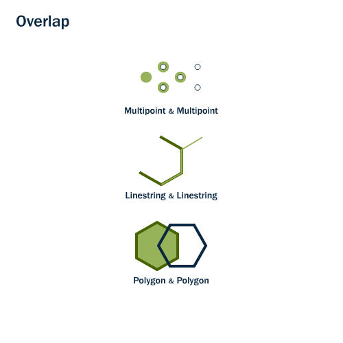
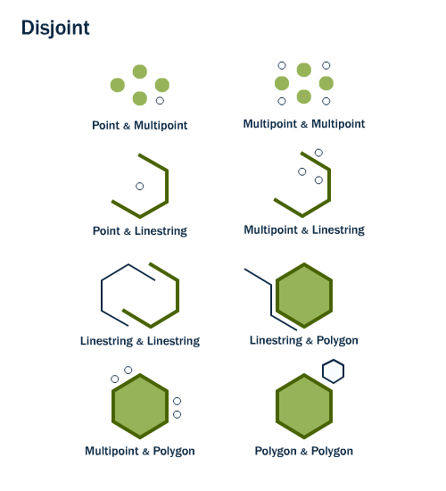
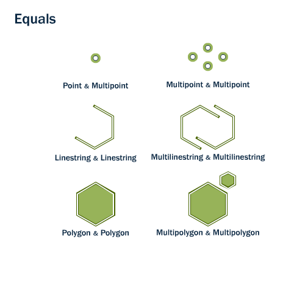

.. _spatial_relationships:

SPATIAL RELATIONSHIPS
=====================

So far we have only used spatial functions that measure (ST_Area_, ST_Length_), serialize (ST_AsGML_), and deserialize (ST_GeomFromText_) geometries. What these functions have in common is that they only work on one geometry at a time.

Spatial databases are powerful because they not only store geometry, they also have the ability to compare *relationships between geometries*. 

Questions like "Which are the closest bike racks to a park?" or "Where are the intersections of subway lines and streets?" can only be answered by comparing geometries representing the bike racks, streets, and subway lines.

The OGC (SFSQL_) and ISO (SQLMM_) defines the following set of methods to compare geometries:

ST_Crosses,ST_Overlaps, ST_Touches, ST_Within and ST_Disjoint
==============================================================

ST_Crosses
----------

.. figure:: ./spatial_relationships/st_crosses.png  
   :align: center

For multipoint/polygon, multipoint/linestring, linestring/linestring, linestring/polygon, and linestring/multipolygon comparisons, ST_Crosses_ (geometry A, geometry B) returns t (TRUE) if the intersection results in a geometry whose dimension is one less than the maximum dimension of the two source geometries and the intersection set is interior to both source geometries.

ST_Overlaps
-----------

ST_Overlaps_ (geometry A, geometry B) compares two geometries of the same dimension and returns TRUE if their intersection set results in a geometry different from both but of the same dimension.

ST_Touches
----------

ST_Touches_ tests whether two geometries touch at their boundaries, but do not intersect in their interiors 

.. figure:: ./spatial_relationships/st_touches.png
   :align: center

ST_Touches_ (geometry A, geometry B) returns TRUE if either of the geometries' boundaries intersect or if only one of the geometry's interiors intersects the other's boundary.

ST_Within and ST_Contains
-------------------------

ST_Within_ and ST_Contains_ test whether one geometry is fully within the other. 

.. figure:: ./spatial_relationships/st_within.png
   :align: center
    
ST_Within_ (geometry A , geometry B) returns TRUE if the first geometry is completely within the second geometry.

ST_Within_ tests for the exact opposite result of ST_Contains_.  

ST_Contains_ (geometry A, geometry B) returns TRUE if the second geometry is completely contained by the first geometry. 

ST_Disjoint
-----------

ST_Disjoint_ (geometry A , geometry B). If two geometries are disjoint, they do not intersect, and vice-versa. In fact, it is often more efficient to test "not intersects" than to test "disjoint" because the intersects tests can be spatially indexed, while the disjoint test cannot.

ST_Intersects, ST_Distance, ST_DWithin and ST_Equals
====================================================

ST_Intersects
-------------

The opposite of ST_Disjoint_ is ST_Intersects_, ST_Crosses_, and ST_Overlaps_ tests whether the interiors of the geometries intersect. 

ST_Intersects_ (geometry A, geometry B) returns t (TRUE) if the two shapes have any space in common, i.e., if their boundaries or interiors intersect.

Let's take our Broad Street subway station and determine its neighborhood using the ST_Intersects_ function:

.. code-block:: sql

  SELECT name, ST_AsText(geom)
  FROM nyc_subway_stations 
  WHERE name = 'Broad St';               

::

      name   |                st_astext
   ----------+------------------------------------------
    Broad St | POINT(583571.905921312 4506714.34119218)

.. code-block:: sql   

  SELECT name, boroname 
  FROM nyc_neighborhoods
  WHERE ST_Intersects(geom, ST_GeomFromText('POINT(583571.905921312 4506714.34119218)',26918));

::

                  name                | boroname
   -----------------------------------+-----------
    Battery Park City-Lower Manhattan | Manhattan

ST_Distance and ST_DWithin
--------------------------

An extremely common GIS question is:

  Find all the stuff within distance X of this other stuff 

The ST_Distance_ (geometry A, geometry B) calculates the *shortest* distance between two geometries and returns it as a float. This is useful for actually reporting back the distance between objects.

.. code-block:: sql

  SELECT ST_Distance(
    ST_GeometryFromText('POINT(0 5)'),
    ST_GeometryFromText('LINESTRING(-2 2, 2 2)'));

::

    st_distance
   -------------
              3

For testing whether two objects are within a distance of one another, the ST_DWithin_ function provides an index-accelerated true/false test. This is useful for questions like "how many trees are within a 500 meter buffer of the road?". You don't have to calculate an actual buffer, you just have to test the distance relationship.

.. figure:: ./spatial_relationships/st_dwithin.png
  :align: center
    
Using our Broad Street subway station again, we can find the streets nearby (within 10 meters of) the subway stop:

.. code-block:: sql

  SELECT name 
  FROM nyc_streets 
  WHERE ST_DWithin(
          geom, 
          ST_GeomFromText('POINT(583571.905921312 4506714.34119218)',26918), 
          10
        );

:: 

       name     
  --------------
     Wall St
     Broad St
     Nassau St

And we can verify the answer on a map. The Broad St station is actually at the intersection of Wall, Broad and Nassau Streets.

ST_Equals
---------
 
ST_Equals_ (geometry A, geometry B) tests the spatial equality of two geometries. 

ST_Equals_ returns TRUE if two geometries of the same type have identical x,y coordinate values, i.e. if the second shape is equal (identical) to the first shape.

First, let's retrieve a representation of a point from our ``nyc_subway_stations`` table. We'll take just the entry for 'Broad St'.

.. code-block:: sql

  SELECT name, geom, ST_AsText(geom)
  FROM nyc_subway_stations 
  WHERE name = 'Broad St';             

::

     name   |                      geom                          |      st_astext
  ----------+----------------------------------------------------+-----------------------
   Broad St | 0101000020266900000EEBD4CF27CF2141BC17D69516315141 | POINT(583571.905921312 4506714.34119218)
 
Then, plug the geometry representation back into an ST_Equals_ test:

.. code-block:: sql

  SELECT name 
  FROM nyc_subway_stations 
  WHERE ST_Equals(geom, '0101000020266900000EEBD4CF27CF2141BC17D69516315141');

::

      name
   ----------
    Broad St

------

.. note:: - The representation of the point was not very human readable (``0101000020266900000EEBD4CF27CF2141BC17D69516315141``) but it was an exact representation of the coordinate values. For a test like equality, using the exact coordinates is necessary.

------

Function List
=============

ST_Area_ : Returns the area of the surface if it is a polygon or multi-polygon. For ``geometry`` type area is in SRID_ units. For ``geography`` area is in square meters.

ST_Length_ : Returns the 2d length of the geometry if it is a linestring or multilinestring. geometry are in units of spatial reference and geography are in meters (default spheroid)

ST_AsGML_ : Returns the geometry as a GML_ version 2 or 3 element.

ST_GeomFromText_ : Returns a specified ST_Geometry value from Well-Known Text representation (WKT_).

ST_Relate_ (geometry A, geometry B): Returns a text string representing the DE9IM relationship between the geometries.

ST_Contains_ (geometry A, geometry B): Returns true if and only if no points of B lie in the exterior of A, and at least one point of the interior of B lies in the interior of A.

ST_Crosses_ (geometry A, geometry B): Returns TRUE if the supplied geometries have some, but not all, interior points in common.

ST_Disjoint_ (geometry A , geometry B): Returns TRUE if the Geometries do not "spatially intersect" - if they do not share any space together.

ST_Overlaps_ (geometry A, geometry B): Returns TRUE if the Geometries share space, are of the same dimension, but are not completely contained by each other.

ST_Touches_ (geometry A, geometry B): Returns TRUE if the geometries have at least one point in common, but their interiors do not intersect.

ST_Within_ (geometry A , geometry B): Returns true if the geometry A is completely inside geometry B

ST_Distance_ (geometry A, geometry B): Returns the 2-dimensional cartesian minimum distance (based on spatial ref) between two geometries in projected units. 

ST_DWithin_ (geometry A, geometry B, radius): Returns true if the geometries are within the specified distance (radius) of one another. 

ST_Equals_ (geometry A, geometry B): Returns true if the given geometries represent the same geometry. Directionality is ignored.

ST_Intersects_ (geometry A, geometry B): Returns TRUE if the Geometries/Geography "spatially intersect" - (share any portion of space) and FALSE if they don't (they are Disjoint). 

.. _SFSQL: http://www.opengeospatial.org/standards/sfa

.. _SQLMM: https://www.iso.org/standard/60343.html

.. _DE-9IM: http://en.wikipedia.org/wiki/DE-9IM

.. _SFSQL: http://www.opengeospatial.org/standards/sfa

.. _SQLMM: https://www.iso.org/standard/60343.html

.. _ST_Relate: http://postgis.net/docs/ST_Relate.html

.. _ST_Crosses: http://postgis.net/docs/ST_Crosses.html

.. _ST_Disjoint: http://postgis.net/docs/ST_Disjoint.html

.. _ST_Within: http://postgis.net/docs/ST_Within.html

.. _ST_Overlaps: http://postgis.net/docs/ST_Overlaps.html

.. _ST_Touches: http://postgis.net/docs/ST_Touches.html

.. _ST_Contains: http://postgis.net/docs/ST_Contains.html

.. _ST_Distance: http://postgis.net/docs/ST_Distance.html

.. _ST_DWithin: http://postgis.net/docs/ST_DWithin.html

.. _ST_Intersects: http://postgis.net/docs/ST_Intersects.html

.. _ST_Equals: http://postgis.net/docs/ST_Equals.html

.. _WKT: https://en.wikipedia.org/wiki/Well-known_text_representation_of_geometry

.. _ST_Area: http://postgis.net/docs/ST_Area.html 

.. _ST_Length: http://postgis.net/docs/ST_Length.html

.. _ST_AsGML: http://postgis.net/docs/ST_AsGML.html

.. _ST_GeomFromText: http://postgis.net/docs/ST_GeomFromText.html

.. _SRID: https://en.wikipedia.org/wiki/Spatial_reference_system
